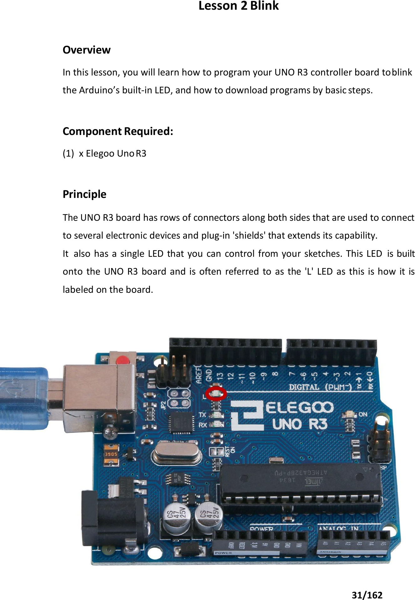

# Mission 0 · Meet Your Robot Brain

## 🎯 What you're making

You're going to make the tiny "L" light on your Arduino blink. No wires. No extra parts. Just you, a USB cable, and your Arduino. This mission teaches you how to send code to the board — which is the one skill you need for everything that comes next.



*The little socket on the left is where the USB cable plugs in. The tiny orange or yellow light labeled **L** is the one you'll make blink.*

---

How does it work? You plug the Arduino into your computer with a USB cable. The Arduino software sends your code down that cable. The board saves it and runs it — even if you unplug later, as long as it has power it keeps going.

## 💻 Load the code

1. Open the file **`sketches/m0_blink/m0_blink.ino`** in the Arduino software.
2. Tell it which board: **Tools → Board → Arduino Uno**.
3. Tell it which port: **Tools → Port** — pick the one that says `/dev/ttyUSB0` or `/dev/ttyACM0`. That's your Arduino.
4. Click the **Upload** button (the round → arrow near the top). Wait for it to say **"Done uploading."**

## ✅ It works when…

The **L** light blinks on for 1 second, off for 1 second, over and over. You should be able to count the blinks like a slow heartbeat.

## 🔧 Not working? Try…

- **No port like `/dev/ttyUSB0` in the menu?** Unplug the USB cable and plug it back in. Try a different USB port on the computer. Some cables are power-only — try a different cable if you have one.
- **Error about "permission denied" or the port?** That's a Linux thing. Ask your grown-up — they'll need to run a quick command (see Grown-up's corner below).
- **Upload fails for no obvious reason?** Make sure **Tools → Board** says **Arduino Uno**.

## 🔬 Now try this

- Find the two lines that say `delay(1000)`. Change both numbers to `100`. Click Upload again — the light blinks super fast! `100` means 100 milliseconds, which is one-tenth of a second.
- Now try `2000` in both spots. Much slower, right? `1000` milliseconds = 1 second. You're controlling time with a number.
- **Bonus:** what happens if the two `delay` numbers are different — like `200` and `800`?

## 💡 What's happening

Your code has two parts. `setup()` runs once when the board starts up — it gets pin 13 (the "L" light) ready to use. Then `loop()` runs again and again, forever. Inside `loop()`, `HIGH` turns the light on, `LOW` turns it off, and `delay` makes the board wait. That's really it — that's how almost every Arduino program works.

## 👨‍👩‍👧 Grown-up's corner

On Linux, the Arduino shows up as a serial port — usually `/dev/ttyACM0` for genuine Uno boards, or `/dev/ttyUSB0` for CH340-based clones. If uploads fail with "permission denied," the user isn't in the `dialout` group yet. Fix it with:

```
sudo usermod -a -G dialout $USER
```

Then log out and back in. The change takes effect on next login. This is a one-time setup — all future uploads will work without it.
