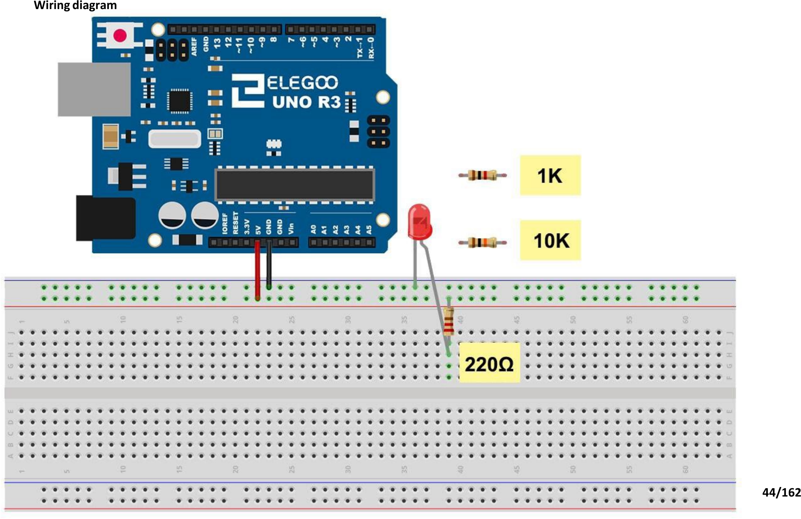

# Mission 1 · First Light

## 🎯 What you're making

You're going to build your own light on a breadboard and make it blink. Not a built-in light — YOUR light. Because your code told it to.

## 🧰 Grab these parts

- [ ] Arduino Uno × 1
- [ ] Breadboard × 1
- [ ] Red LED × 1 (two legs — one long, one short)
- [ ] 220Ω resistor × 1 (stripes: red, red, brown)
- [ ] Jumper wires × 2 (male-to-male)

## 🔌 Build it

The LED has a long leg (+) and a short leg (–). It only lights up when the legs point the right way.

1. Push the LED into the breadboard. The two legs go in **two different rows**.
2. Take the 220Ω resistor. Put one end in the **same row as the LED's long (+) leg**. Put the other end a few rows away in an empty row. (Resistors work in either direction — no wrong way.)
3. Run a **jumper wire from pin 8** on the Arduino to the **free end of the resistor**.
4. Run a **jumper wire from the LED's short (–) leg row** to a **GND pin** on the Arduino.

*Yours will look like this. One difference: the wire going to the board connects to **pin 8** (not 5V) so the Arduino can switch the light on and off.*

## 💻 Load the code

1. Open **`sketches/m1_first_light/m1_first_light.ino`** in the Arduino software.
2. Set **Tools → Board → Arduino Uno**.
3. Set **Tools → Port** → pick `/dev/ttyUSB0` or `/dev/ttyACM0`.
4. Click **Upload**. Wait for "Done uploading."

## ✅ It works when…

Your LED blinks on and off twice a second — a quick, steady flash. Count: on-off-on-off, like a fast heartbeat.

## 🔧 Not working? Try…

- **LED not lighting up at all?** LEDs only work one way. Pull it out, flip it around, and push it back in. The long leg should be on the same side as the resistor (toward pin 8).
- **LED is in but nothing happens?** Make sure the resistor and the wires are pushed firmly into the holes. Breadboard holes can be sneaky — give them a firm push.
- **Upload error or no port?** Head back to Mission 0's troubleshooting section — same fix.

## 🔬 Now try this

- Find the two lines with `delay(500)`. Change both to `delay(1000)`. Upload — now it blinks slower, once a second.
- Swap the 220Ω resistor for a 1kΩ resistor. Upload again. The LED gets a little dimmer. Try a 10kΩ — even dimmer. A bigger resistor lets less electricity through.

## 💡 What's happening

Pin 8 turns on and off. When it's on (`HIGH`), electricity flows like this:

**pin 8 → resistor → LED → GND**

The resistor protects the LED — too much electricity would burn it out. And the LED only lights up when its long leg is on the + side. That's why flipping it matters.

## 👨‍👩‍👧 Grown-up's corner

We use pin 8 deliberately to keep pin 13 (which drives the onboard L LED) out of the picture — otherwise both LEDs would blink and confuse debugging. 220Ω is the textbook safe value for a 5V supply with a standard red LED (forward voltage ≈ 2V, target current ≈ 14 mA). The higher-resistance variants in the "Now try this" section visually demonstrate current limiting without any risk of damage.
