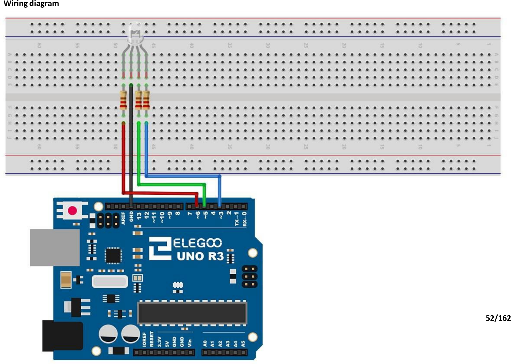

# Mission 1 · Bonus: Rainbow Light

## 🎯 What you're making

One tiny LED that can glow any color you want — red, green, blue, yellow, purple, white. It's all in one little package, and you're going to control it.

## 🧰 Grab these parts

- [ ] Arduino Uno × 1
- [ ] Breadboard × 1
- [ ] RGB LED × 1 (the clear one with **4 legs**)
- [ ] 220Ω resistors × 3 (stripes: red, red, brown)
- [ ] Jumper wires × 4

## 🔌 Build it

This LED has 4 legs — one for red, one for green, one for blue, and one that's the shared minus (–). The **longest leg** is the minus leg.

1. Push the RGB LED into the breadboard so all 4 legs are in different rows.
2. **Longest leg (–) → GND pin** on the Arduino. This is the shared ground for all three colors.
3. **Red leg** (next to the longest leg) → 220Ω resistor → **pin 6**.
4. **Green leg** → 220Ω resistor → **pin 5**.
5. **Blue leg** (on the other side of the longest leg) → 220Ω resistor → **pin 3**.



*The longest leg is the minus leg — it connects straight to GND. The other three go through resistors to pins 6, 5, and 3.*

## 💻 Load the code

1. Open **`sketches/m1_rgb_rainbow/m1_rgb_rainbow.ino`** in the Arduino software.
2. Set **Tools → Board → Arduino Uno**.
3. Set **Tools → Port** → `/dev/ttyUSB0` or `/dev/ttyACM0`.
4. Click **Upload**.

## ✅ It works when…

The LED slowly cycles through six colors: red → green → blue → yellow → purple → white. It glows one color for about a second, then switches to the next.

## 🔧 Not working? Try…

- **No light at all?** Make sure the **longest** leg goes to GND. That's the most common mix-up with this LED.
- **Only some colors show?** One of the colored legs is probably in the wrong row. Check: red = pin 6, green = pin 5, blue = pin 3.
- **Colors look swapped — like red shows up green?** The legs are easy to mix up. Count from the longest leg to figure out which is which.

## 🔬 Now try this

- Invent your own color. Find the color lines inside `loop()` and add a new one:
  ```
  setColor(255, 100, 0);  delay(1000);  // orange
  ```
  The three numbers are how much red, green, and blue to mix — each from 0 (off) to 255 (full blast). Try different combos.
- Try `setColor(50, 50, 50)` for a dim white. Try `setColor(255, 20, 147)` for hot pink.
- Change a `delay(1000)` to `200` to make that color flash by really fast.

## 💡 What's happening

Inside the LED are three tiny lights — red, green, and blue — all in one package. `analogWrite` can set each one anywhere from 0 (off) to 255 (full brightness). When you mix different amounts of red, green, and blue light, you get other colors. That's exactly how your phone screen or TV makes every color you see.

## 👨‍👩‍👧 Grown-up's corner

This is a common-cathode RGB LED — the shared cathode (–) goes to GND, and higher `analogWrite` values mean brighter. Pins 3, 5, and 6 are PWM-capable on the Uno, which is why we chose them; `analogWrite` uses pulse-width modulation to simulate variable brightness. The `setColor` helper is a clean intro to functions with parameters: it wraps three `analogWrite` calls, so the child sees one readable verb per color rather than three raw writes.
