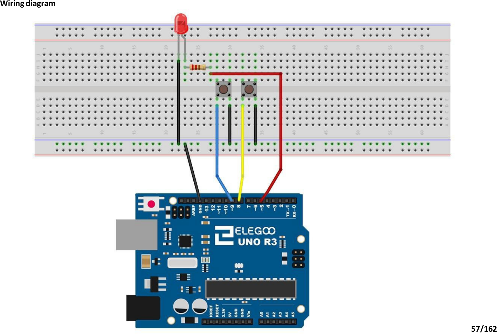

# Mission 2 · Button Switch

## 🎯 What you're making

You're going to control an LED with two push buttons. Press one button — the light turns on. Press the other — it turns off. You're in charge now.

## 🧰 Grab these parts

- [ ] Arduino Uno × 1
- [ ] Breadboard × 1
- [ ] Red LED × 1 (long leg and short leg)
- [ ] 220Ω resistor × 1 (stripes: red, red, brown)
- [ ] Push buttons × 2 (the small square ones)
- [ ] Jumper wires × 7 (male-to-male)

## 🔌 Build it

Push buttons have four legs. The legs on the **same short side** are always connected together. Legs on **opposite sides** are NOT connected — until you press the button.

1. Push **button A** into the breadboard near the middle. Make sure each pair of legs is in a different column.
2. Push **button B** right next to it, leaving one empty column between them.
3. Run a wire from **pin 9** on the Arduino to **one leg of button A** (the leg nearest the top of the breadboard).
4. Run a wire from **GND** on the Arduino to the **other leg of button A** (the leg nearest the bottom).
5. Run a wire from **pin 8** on the Arduino to **one leg of button B** (top side).
6. Run a wire from **GND** to the **other leg of button B** (bottom side). You can share the same GND rail.
7. Place the **LED** on the left side of the breadboard. Long (+) leg to one row, short (–) leg to the next row.
8. Push the **220Ω resistor** between the **long (+) leg's row** and a free row.
9. Run a wire from **pin 5** on the Arduino to that free row (the far end of the resistor).
10. Run a wire from the **short (–) leg's row** to **GND**.

*Your build should look like this. Button A is on the left (pin 9), button B is on the right (pin 8), LED is further left (pin 5).*

## 💻 Load the code

1. Open **`sketches/m2_button/m2_button.ino`** in the Arduino software.
2. Set **Tools → Board → Arduino Uno**.
3. Set **Tools → Port** → pick `/dev/ttyUSB0` or `/dev/ttyACM0`.
4. Click **Upload**. Wait for "Done uploading."

## ✅ It works when…

You press **button A** and the LED lights up. You press **button B** and the LED goes off. The LED stays however you left it until you press a button again.

## 🔧 Not working? Try…

- **LED won't light up at all?** Flip the LED around — the long (+) leg should be on the resistor side (toward pin 5).
- **Button doesn't seem to do anything?** Make sure the button legs are in the right holes. The two legs on the **same short side** of the button must be in different columns. If they're in the same column they're already shorted together.
- **Both buttons turn it off?** You may have button A and button B swapped. Check that pin 9 goes to button A and pin 8 goes to button B.
- **Upload error?** Head to Mission 0's troubleshooting section for the port and permission fix.

## 🔬 Now try this

- In the code, find where it says `HIGH` (LED on). Change it to `LOW`. Upload — now button A turns the LED **off** and button B turns it **on**. You flipped which button does what.
- Find the two `if` blocks. Copy one and add a third `if` that checks a **new pin** — say pin 7. Wire a third button to pin 7 and GND. Upload. Now you have a third button that does something.
- What happens if you hold **both** buttons at the same time? Try it. (Hint: which `if` runs last?)

## 💡 What's happening

Each button is wired between a pin and GND. The Arduino uses a built-in "pull-up" resistor that keeps the pin HIGH when nothing is pressed. When you press the button, it connects the pin to GND, pulling it LOW. The code checks: if a pin is LOW, a button is being pressed. That's the signal to turn the LED on or off.

## 👨‍👩‍👧 Grown-up's corner

`INPUT_PULLUP` activates the Uno's internal ~20–50 kΩ pull-up resistor on each pin, so no external resistor is needed for the buttons. The "pressed = LOW" logic (active-low) is standard for tactile switches. The LED is on a separate output pin (5) with a 220Ω current-limiting resistor — same circuit as Mission 1. The "what if both buttons pressed" question at the end of the explore section is a gentle intro to race conditions: the second `if` always wins because it runs after the first.
