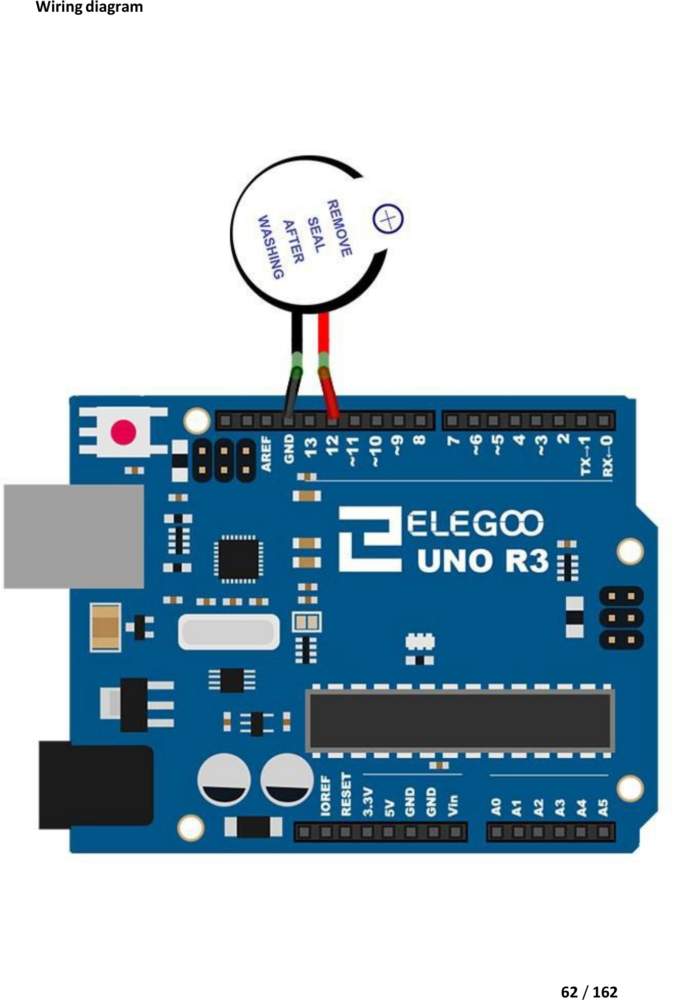

# Mission 3 · Beep!

## 🎯 What you're making

You're going to make your Arduino buzz. Not a boring single beep — a pattern: slow beeps, then fast beeps, then one long honk. You're making noise with code.

## 🧰 Grab these parts

- [ ] Arduino Uno × 1
- [ ] Active buzzer × 1 (the round one with the sticker — it has a + on top)
- [ ] Jumper wires × 2 (female-to-male, or male-to-male + small wires)

## 🔌 Build it

The active buzzer has two legs. The **longer leg is +** and the **shorter leg is –** (just like an LED). The + leg connects to a pin; the – leg connects to GND.

1. Find your **active buzzer**. Look for the tiny **+** printed on top. That side is the positive leg.
2. Plug a **jumper wire from pin 12** on the Arduino to the **+ (longer) leg** of the buzzer.
3. Plug a **jumper wire from any GND pin** on the Arduino to the **– (shorter) leg** of the buzzer.

That's it — no resistor, no breadboard needed. The active buzzer wires straight to the Arduino.

*Your buzzer wires straight to the Arduino — two wires total. + goes to pin 12; – goes to GND.*

## 💻 Load the code

1. Open **`sketches/m3_beep/m3_beep.ino`** in the Arduino software.
2. Set **Tools → Board → Arduino Uno**.
3. Set **Tools → Port** → pick `/dev/ttyUSB0` or `/dev/ttyACM0`.
4. Click **Upload**. Wait for "Done uploading."

## ✅ It works when…

You hear a pattern: three slow beeps, then three fast beeps, then one long honk. Then two seconds of quiet. Then it repeats. If you hear the pattern, you've done it.

## 🔧 Not working? Try…

- **No sound at all?** Check that the + leg of the buzzer is on pin 12. The + leg is the longer one — same rule as LEDs.
- **Still nothing?** Make sure both wires are pushed in firmly. Try swapping which leg goes where — sometimes a buzzer leg sneaks into the wrong hole.
- **Upload error?** Go back to Mission 0's troubleshooting section for the port and permission fix.

## 🔬 Now try this

- Find the lines that say `delay(500)`. Change them to `delay(200)`. Upload — the slow beeps are now faster. Try `delay(1000)` to make them slower.
- Change the `3` in `for (int i = 0; i < 3; i++)` to `5`. Upload — now you get five slow beeps instead of three.
- Change the long-beep `delay(1000)` to `delay(3000)`. Upload — the last honk holds for three full seconds.

## 💡 What's happening

An **active buzzer** has a tiny circuit built inside it. When you send it electricity, it buzzes on its own — you just turn it on and off with `HIGH` and `LOW`. The pauses (`delay`) control how long each beep lasts. Short delays make fast beeps; long delays make slow ones. That's your whole rhythm section.

## 👨‍👩‍👧 Grown-up's corner

An active buzzer contains an internal oscillator that drives the piezo element at a fixed frequency (typically ~2.5 kHz). `digitalWrite(12, HIGH)` applies 5 V across the buzzer, triggering its internal circuit. This makes it simpler than a passive buzzer but less flexible — it only makes one pitch. No current-limiting resistor is required; the buzzer's internal resistance keeps current safe. The `for` loops in this sketch are a good first look at counted repetition — the kid can tweak the count and delay values to compose their own beep pattern.
