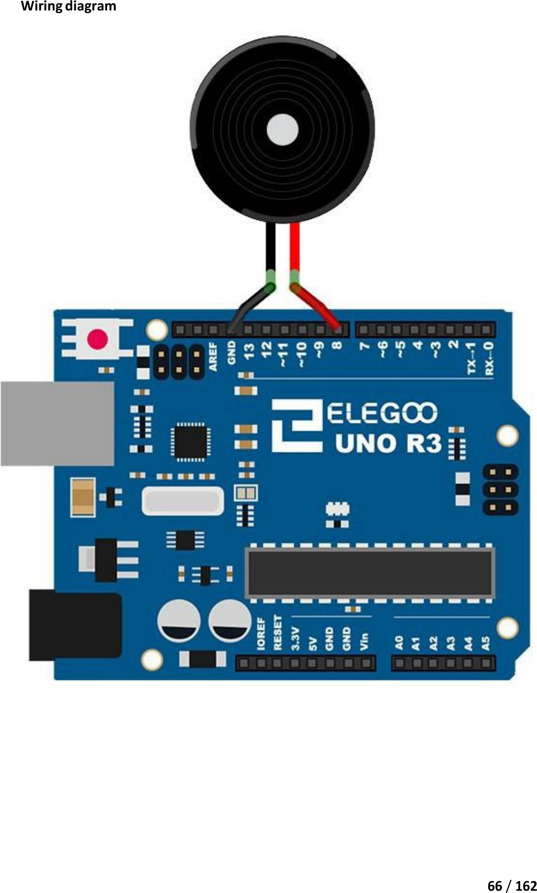

# Mission 3 · Mini Piano

## 🎯 What you're making

You're going to build a two-button piano. Press one button and it plays a note. Press the other and it plays a different note. Press both at once and you get a third note. It's a real instrument — sort of.

## 🧰 Grab these parts

- [ ] Arduino Uno × 1
- [ ] Breadboard × 1
- [ ] Passive buzzer × 1 (the round one without a sticker — it looks like a tiny speaker)
- [ ] Push buttons × 2 (the small square ones from Mission 2)
- [ ] Jumper wires × 6 (male-to-male)

## 🔌 Build it

The passive buzzer has two legs — a longer + leg and a shorter – leg. The buttons are the same small square ones from Mission 2.

**Wire the buzzer:**

1. Push the **passive buzzer** into the breadboard. The two legs go in two different rows.
2. Run a **jumper wire from pin 12** on the Arduino to the **longer + leg** of the buzzer.
3. Run a **jumper wire from GND** on the Arduino to the **shorter – leg** of the buzzer.

**Wire button A (plays note C):**

4. Push **button A** into the breadboard near the center. Make sure each pair of legs is in a different column.
5. Run a wire from **pin 9** on the Arduino to **one leg of button A** (the leg nearest the top of the board).
6. Run a wire from **GND** to the **other leg of button A** (the leg nearest the bottom).

**Wire button B (plays note E):**

7. Push **button B** right next to button A, leaving one empty column between them.
8. Run a wire from **pin 8** on the Arduino to **one leg of button B** (top side).
9. Run a wire from **GND** to the **other leg of button B** (bottom side). Share the same GND rail.

*This shows the passive buzzer wired to the Arduino. Yours adds the two buttons from Mission 2 — button A to pin 9 and button B to pin 8, each with its other leg going to GND.*

## 💻 Load the code

1. Open **`sketches/m3_mini_piano/m3_mini_piano.ino`** in the Arduino software.
2. Set **Tools → Board → Arduino Uno**.
3. Set **Tools → Port** → pick `/dev/ttyUSB0` or `/dev/ttyACM0`.
4. Click **Upload**. Wait for "Done uploading."

## ✅ It works when…

You press **button A** and hear a low note (C). You press **button B** and hear a higher note (E). You press **both at the same time** and hear a different note (G). Let go of everything and the buzzer goes quiet. Three buttons, three notes, one piano.

## 🔧 Not working? Try…

- **No sound at all?** Check the buzzer legs — the longer + leg must be on pin 12, not GND. Try flipping the buzzer if you're not sure.
- **Button A plays nothing?** Make sure pin 9 goes to one leg of button A and GND goes to the other leg. The two legs on the **same short side** of the button must be in different columns.
- **Wrong notes?** Check that pin 9 goes to button A and pin 8 goes to button B (not the other way around).
- **Upload error?** Go back to Mission 0's troubleshooting section for the port and permission fix.

## 🔬 Now try this

- In the code, find `NOTE_C4 = 262`. Change it to `NOTE_C4 = 294`. Upload — button A now plays D instead of C. Try other values from the list at the top of the sketch.
- Change `NOTE_E4 = 330` to `NOTE_E4 = 440`. Upload — button B plays a higher A note.
- Find `tone(BUZZER, NOTE_G4)` (the both-buttons note). Change `NOTE_G4` to `NOTE_C5` (523). Upload — pressing both buttons plays a high C.

## 💡 What's happening

A **passive buzzer** doesn't have a built-in sound circuit. You have to drive it yourself. The `tone()` command sends a fast pulse to the buzzer pin — the number you give it (like 262) tells it how many times per second to pulse. More pulses per second = higher pitch. `noTone()` stops the pulses and the buzzer goes quiet. The buttons just tell the Arduino which frequency to send. That's all music is — different vibration speeds.

## 👨‍👩‍👧 Grown-up's corner

`tone(pin, frequency)` uses Timer 2 on the ATmega328P to generate a square wave at the given frequency (in Hz) on the specified pin. The passive buzzer's piezo element vibrates at that rate, producing the pitch. `noTone()` stops the timer output. We use pin 12 for the buzzer to avoid the pin-8 conflict with button B — the two buttons occupy pins 8 and 9, matching Mission 2 exactly so no re-wiring is needed. The "both buttons = G" feature is a fun first taste of chord logic: one condition, one frequency. The full note-frequency table in the sketch (C4 through C5) lets the child experiment freely without looking anything up.
