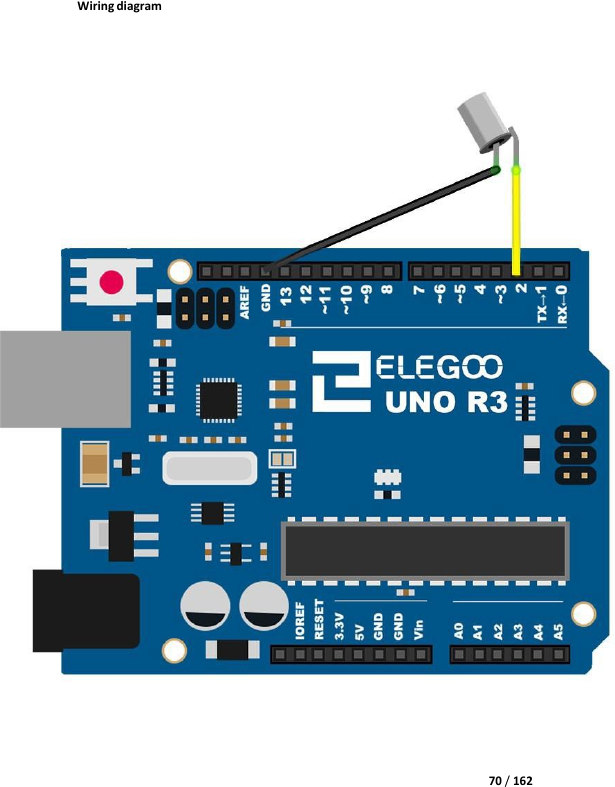

# Mission 4 · Tilt Switch

## 🎯 What you're making

You're going to wire up a tiny ball switch. Tilt it one way — the built-in LED lights up. Tilt it back — LED goes dark. The sensor is just a hollow tube with a metal ball inside. Simple, and kind of magical.

## 🧰 Grab these parts

- [ ] Arduino Uno × 1
- [ ] Breadboard × 1
- [ ] Tilt switch (ball switch) × 1 (small silver cylinder — two legs)
- [ ] Jumper wires × 2 (male-to-male)

*(The built-in LED on pin 13 is already on your board — no extra LED needed.)*

## 🔌 Build it

The tilt switch has **two legs** — it doesn't matter which way around they go.

1. Push the tilt switch into the breadboard. The two legs go in **two different rows**.
2. Run a **jumper wire from pin 2** on the Arduino to one of the tilt switch's legs.
3. Run a **jumper wire from a GND pin** on the Arduino to the other leg.

That's it — just two wires! The pull-up resistor is built into the code, so you don't need an extra resistor.

## 💻 Load the code

1. Open **`sketches/m4_tilt/m4_tilt.ino`** in the Arduino software.
2. Set **Tools → Board → Arduino Uno**.
3. Set **Tools → Port** → pick `/dev/ttyUSB0` or `/dev/ttyACM0`.
4. Click **Upload**. Wait for "Done uploading."

## ✅ It works when…

You tilt the Arduino + breadboard gently to one side and the small **L LED** on the Arduino board turns on. Tilt it back and the LED turns off. The LED changes every time you switch direction.

## 🔧 Not working? Try…

- **LED never changes?** Make sure both jumper wires are firmly pushed in. The switch legs are thin — wiggle them until they're secure in the breadboard holes.
- **LED is always on or always off?** Try swapping the two switch legs in the breadboard (they go in different rows — put each one in a different pair of rows). The switch is symmetric, but your tilt angle matters.
- **Upload error?** See Mission 0's troubleshooting for the port and permission fix.

## 🔬 Now try this

- Tilt the board slowly. There's a moment right in the middle where the ball is balanced — the LED might flicker. That's the ball rolling!
- In the code, find `digitalWrite(ledPin, HIGH)` and change it to `digitalWrite(ledPin, LOW)`. Change the other one to `HIGH`. Upload — now the logic is flipped. Tilting one way turns the LED **off** instead.
- Connect an extra LED with a 220Ω resistor to **pin 8** and change `ledPin` to `8`. Now your tilt switch controls an LED on the breadboard.

## 💡 What's happening

Inside the tilt switch is a tiny metal ball. When you tilt the sensor one way, the ball rolls and touches two metal contacts — this closes the circuit, so pin 2 reads **LOW** (because the pull-up resistor pulls it high, and the switch connects it to GND). The other way, the ball rolls away, the circuit is open, and pin 2 reads **HIGH**. The code watches pin 2 and turns the LED on or off based on that reading.

## 👨‍👩‍👧 Grown-up's corner

`INPUT_PULLUP` connects an internal ~20–50 kΩ pull-up resistor between the pin and 5V, so the resting state is HIGH. When the switch closes (ball touching contacts → GND path established), the pin reads LOW. This inverted logic is standard for button/switch circuits on the Uno. The built-in LED on pin 13 has its own onboard resistor, so no external resistor is needed. Kit reference: Lesson 8 "Ball Switch."
