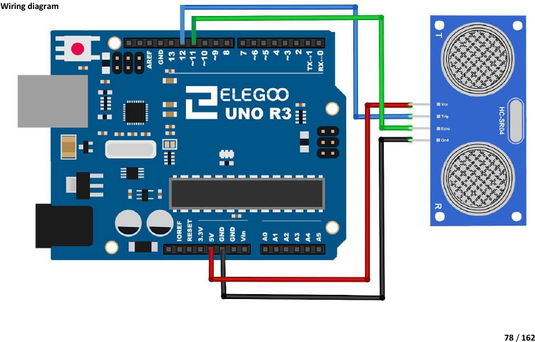

# Mission 4 · Distance Alarm

## 🎯 What you're making

A motion alarm! The HC-SR04 sensor bounces invisible sound waves off objects and measures how far away they are — like a bat. When something gets closer than 15 cm, the buzzer screams. Walk toward it slowly and listen for the beep. This is exactly how parking sensors in cars work.

## 🧰 Grab these parts

- [ ] Arduino Uno × 1
- [ ] Breadboard × 1
- [ ] HC-SR04 ultrasonic sensor × 1 (the wide module with two silver cylinders — looks like robot eyes)
- [ ] Active buzzer × 1 (small black cylinder with a + mark on top — two legs)
- [ ] Jumper wires × 6 (male-to-male)

## 🔌 Build it

**HC-SR04 sensor:**

The sensor has four pins labeled on its back: **VCC, Trig, Echo, GND**.

1. Push the HC-SR04 into the breadboard. All four pins go in **four separate rows**.
2. Run a wire from the **VCC pin's row** to the **5V pin** on the Arduino.
3. Run a wire from the **GND pin's row** to a **GND pin** on the Arduino.
4. Run a wire from the **Trig pin's row** to **pin 12** on the Arduino.
5. Run a wire from the **Echo pin's row** to **pin 11** on the Arduino.

**Active buzzer:**

The buzzer has a **+** mark on one side — that's the positive leg.

6. Push the buzzer into the breadboard. The two legs go in **two different rows**.
7. Run a wire from the **+ leg's row** to **pin 8** on the Arduino.
8. Run a wire from the **other leg's row** to a **GND pin** on the Arduino.

## 💻 Load the code

1. Open **`sketches/m4_distance_alarm/m4_distance_alarm.ino`** in the Arduino software.
2. Set **Tools → Board → Arduino Uno**.
3. Set **Tools → Port** → pick `/dev/ttyUSB0` or `/dev/ttyACM0`.
4. Click **Upload**. Wait for "Done uploading."

## ✅ It works when…

You slowly move your hand toward the sensor. When your hand is **closer than 15 cm**, the buzzer turns on. Move your hand away and the buzzer stops. Open the Serial Monitor (**Tools → Serial Monitor** — same as Mission 0) and watch the distance numbers updating in real time!

## 🔧 Not working? Try…

- **Buzzer makes no sound at all?** Check the + leg is wired to pin 8. Also check the buzzer leg going to GND. Try swapping the buzzer legs — though the + marking usually makes it clear.
- **Buzzer is always on?** Something is in the sensor's path — move any objects away from the front of the sensor. Also check that Trig and Echo are on the right pins (not swapped).
- **Weird or jumping numbers in Serial Monitor?** Make sure VCC is on 5V (not 3.3V). Check all four sensor wires are firmly in the breadboard.
- **Upload error?** See Mission 0's troubleshooting for the port and permission fix.

## 🔬 Now try this

- Open **Tools → Serial Monitor** and set the speed to **9600 baud**. Slowly move your hand toward the sensor from far away. Watch the numbers count down. What's the smallest number you can get?
- In the code, find `const int alarmDistance = 15;`. Change `15` to `30`. Upload — now the alarm triggers from twice as far away. Change it to `5` — you have to almost touch the sensor before it beeps.
- Can you make it beep **faster** the closer you get? In the `loop()`, change `delay(100)` to a shorter delay — try `delay(50)`. What else could you try?

## 💡 What's happening

The HC-SR04 sends out a burst of ultrasonic sound (too high-pitched for humans to hear). Then it listens for the echo bouncing back off an object. The time from send to receive tells us the distance — sound travels about 343 metres per second in air. Dividing the round-trip time by 58 gives the distance in centimetres. The code checks that number: less than 15 cm → beep; otherwise → quiet. It's the same physics as a bat finding a moth in the dark.

## 👨‍👩‍👧 Grown-up's corner

The library-free approach: Trig gets a 10 µs HIGH pulse to start the burst; `pulseIn(echoPin, HIGH)` returns the echo duration in microseconds. Speed of sound ≈ 343 m/s → 0.034 cm/µs round-trip → divide by 58 for one-way cm. The `cm > 0` guard filters the rare timeout (returns 0 when nothing is detected in range). Kit reference: Lesson 10 "Ultrasonic Sensor Module" (kit uses the SR04.h library — we deliberately go library-free here, which is both educational and avoids an install step). The HC-SR04 spec range is 2–400 cm; readings below ~2 cm are unreliable.
