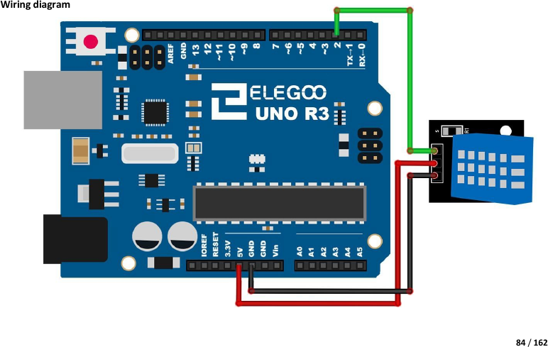

# Mission 4 · DHT11 Weather Station ★ BONUS

## 🎯 What you're making

Your own weather station! The DHT11 sensor reads **temperature** and **humidity** at the same time. Open the Serial Monitor and watch live weather readings update every two seconds — right from a sensor smaller than your thumbnail.

## 🧩 First, install a library

The DHT11 needs a helper library. Do this before wiring anything:

1. Open the Arduino software.
2. Go to **Tools → Manage Libraries…**
3. In the search box, type **SimpleDHT** and press Enter.
4. Find **SimpleDHT** in the list and click **Install**.
5. Close the library manager when it's done.

## 🧰 Grab these parts

- [ ] Arduino Uno × 1
- [ ] Breadboard × 1
- [ ] DHT11 sensor × 1 (small blue or white module with three pins — sometimes on a tiny breakout board)
- [ ] Jumper wires × 3 (male-to-male)

## 🔌 Build it

The DHT11 module has three pins. Look at the labels printed on the board: **–**, **out** (or **S**), and **+**.

1. Push the DHT11 module into the breadboard. The three pins go in **three different rows**.
2. Run a wire from the **– pin's row** to a **GND pin** on the Arduino.
3. Run a wire from the **out (or S) pin's row** to **pin 2** on the Arduino.
4. Run a wire from the **+ pin's row** to the **5V pin** on the Arduino.



## 💻 Load the code

1. Open **`sketches/m4_dht11/m4_dht11.ino`** in the Arduino software.
2. Set **Tools → Board → Arduino Uno**.
3. Set **Tools → Port** → pick `/dev/ttyUSB0` or `/dev/ttyACM0`.
4. Click **Upload**. Wait for "Done uploading."
5. Go to **Tools → Serial Monitor**. Set the speed to **9600 baud** (bottom-right dropdown).

## ✅ It works when…

The Serial Monitor shows new lines every 2 seconds, like this:

```
Temperature: 22 °C    Humidity: 55 %
Temperature: 22 °C    Humidity: 55 %
```

The numbers will match the actual temperature and humidity in your room!

## 🔧 Not working? Try…

- **"Read failed" keeps appearing?** The sensor needs a moment to warm up. Wait 5–10 seconds after uploading before expecting good readings.
- **Library not found (compile error)?** Make sure you installed **SimpleDHT** in Manage Libraries — the exact name matters. Close and reopen the Arduino software after installing.
- **No output in Serial Monitor?** Check the baud rate is set to **9600**. Check the data wire (out/S pin) is on **pin 2**, not another pin.
- **Upload error?** See Mission 0's troubleshooting for the port and permission fix.

## 🔬 Now try this

- Breathe gently on the DHT11 sensor. Your breath is warm and humid — watch the temperature and humidity numbers go up in the Serial Monitor!
- The temperature comes out in **Celsius (°C)**. To convert to Fahrenheit in your head: multiply by 9, divide by 5, add 32. Or add this line to the code right after reading temperature:
  ```cpp
  float tempF = temperature * 9.0 / 5.0 + 32.0;
  Serial.print("  ("); Serial.print(tempF); Serial.println(" °F)");
  ```
- In the code, find `delay(2000)` and change it to `delay(5000)`. Now it reads every 5 seconds instead. The DHT11 only works well if you wait at least 1 second between reads.

## 💡 What's happening

The DHT11 has two tiny sensors inside: one measures temperature (how hot it is), one measures humidity (how much water vapour is in the air). It sends that data through a single wire using a special timing pattern — that's why it needs a library. The SimpleDHT library handles all the tricky timing for you. The Arduino reads the result and sends it to your computer over USB, which is how the Serial Monitor shows it. You're doing real science!

## 👨‍👩‍👧 Grown-up's corner

The DHT11 uses a proprietary single-wire protocol (not I²C or SPI). It sends 40 bits: 8-bit integer humidity, 8-bit humidity decimal (always 0 on the DHT11), 8-bit integer temperature, 8-bit temperature decimal, 8-bit checksum. SimpleDHT handles the timing-sensitive bit-banging in software. The DHT11's accuracy is ±2°C / ±5% RH, adequate for kids' exploration but not calibration-grade. Minimum sampling interval is 1 s; the 2 s delay is conservative and safe. Kit reference: Lesson 11 "DHT11 Temperature and Humidity Sensor." Note: the kit's bundled sketch uses the `dht_nonblocking` library — SimpleDHT is lighter and has a simpler API for this level.
