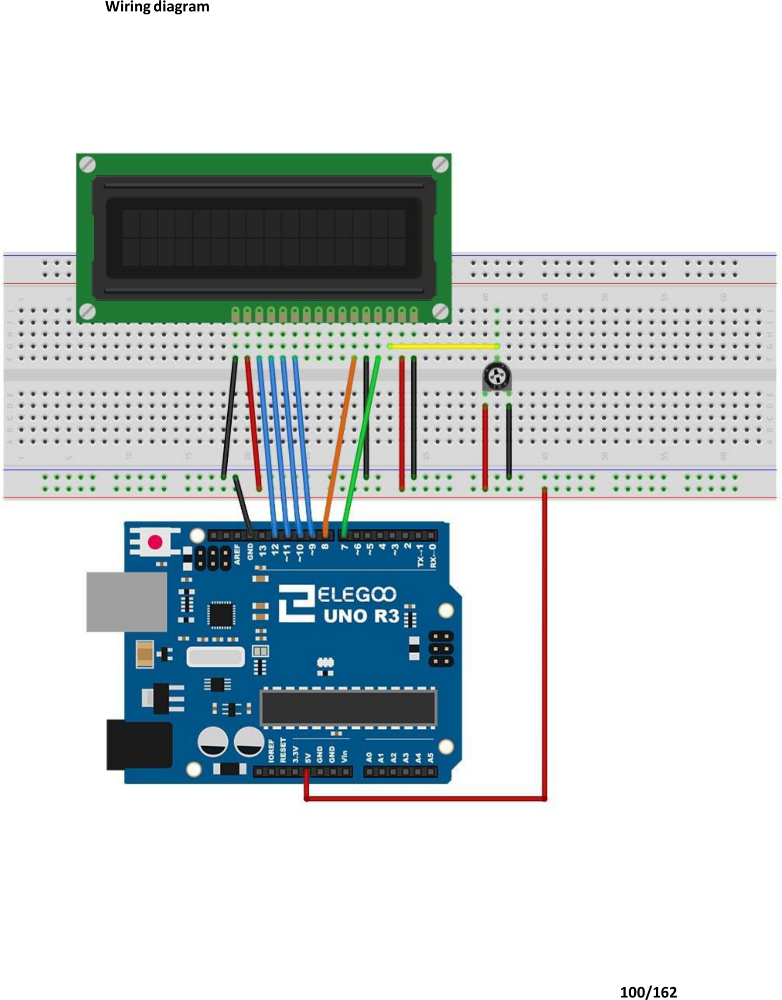

# Mission 5 · Hello Screen

## 🎯 What you're making

You're going to make words appear on a real screen. Not a computer screen — a tiny LCD display that YOUR Arduino controls. You'll type your name into the code, and it shows up on the screen. That's pretty wild.

## 🧰 Grab these parts

- [ ] Arduino Uno × 1
- [ ] Breadboard × 1
- [ ] LCD1602 display module × 1 (the wide blue-and-green screen with two rows of squares)
- [ ] Potentiometer × 1 (the round knob — for contrast)
- [ ] Jumper wires × 16 (male-to-male)

## 🔌 Build it

The LCD has a row of 16 pins along one edge. The kit's wiring image labels them 1–16. Work through them in order — it takes a few minutes, but every wire matters.

> **Tip:** Line up the LCD with the top edge of your breadboard so the 16 pins drop in. The LCD is wide — it needs to span both halves of the breadboard.

1. Push the **LCD** into the breadboard at the top. Its 16 pins plug into 16 holes in a row.
2. **Pin 1 (VSS)** → any **GND** rail on the breadboard.
3. **Pin 2 (VDD)** → **5V** on the Arduino.
4. **Pin 3 (VO — contrast)** → the **middle leg** of the potentiometer.
   - Put the potentiometer on the breadboard. One outer leg → **5V**. The other outer leg → **GND**.
5. **Pin 4 (RS)** → **Arduino pin 7**.
6. **Pin 5 (R/W)** → **GND**. (Always GND — we only write, never read.)
7. **Pin 6 (E — Enable)** → **Arduino pin 8**.
8. **Pins 7, 8, 9, 10 (D0–D3)** → leave these **unconnected**. We use 4-bit mode.
9. **Pin 11 (D4)** → **Arduino pin 9**.
10. **Pin 12 (D5)** → **Arduino pin 10**.
11. **Pin 13 (D6)** → **Arduino pin 11**.
12. **Pin 14 (D7)** → **Arduino pin 12**.
13. **Pin 15 (A — backlight +)** → **5V**.
14. **Pin 16 (K — backlight –)** → **GND**.

*Match this wiring exactly. The rainbow of wires in the middle goes to Arduino pins 7–12. The potentiometer (the knob) is on the right — its middle leg goes to LCD pin 3 for contrast.*

## 💻 Load the code

1. Open **`sketches/m5_hello/m5_hello.ino`** in the Arduino software.
2. Find this line: `lcd.print("Hello, Levi!");`
3. Change `Levi` to **your name**. Keep the `"` marks.
4. Set **Tools → Board → Arduino Uno**.
5. Set **Tools → Port** → `/dev/ttyUSB0` or `/dev/ttyACM0`.
6. Click **Upload**. Wait for "Done uploading."

## ✅ It works when…

Your name appears on the **top row** of the LCD. The bottom row says **"You built this!"** The text stays on — you don't have to do anything to keep it there. The LCD remembers.

## 🔧 Not working? Try…

- **See only boxes or a blank screen?** Turn the **contrast knob** (the potentiometer) slowly. Keep turning until dark squares or letters appear. This is the most common problem — the contrast just needs adjusting.
- **Backlight is on but no text?** Double-check that pins 7–12 on the Arduino match pins RS, E, D4–D7 on the LCD. One wrong wire means silence.
- **Nothing at all — no backlight?** Make sure LCD pin 2 goes to 5V and pin 1 goes to GND. Also check pin 15 (backlight +) is on 5V and pin 16 (backlight –) is on GND.
- **Upload error?** Head to Mission 0's troubleshooting section for the port and permission fix.

## 🔬 Now try this

- Find the second `lcd.print(...)` line. Change `"You built this!"` to something else — a joke, a catchphrase, anything up to 16 characters. Upload and see it appear.
- Try `lcd.setCursor(4, 0);` before the first print. That moves the cursor to column 4, row 0 — your name starts further in. Play with the column number (0–15).
- Add `lcd.setCursor(0, 1);` and `lcd.print("Mission 5 done!");` to fill the bottom row with something new. (The bottom row is row 1, top row is row 0.)

## 💡 What's happening

The LCD has a tiny controller chip inside. The Arduino sends it instructions — "move the cursor here, print this letter" — over six wires. The library handles all the tricky timing so you just call `lcd.print()`. The potentiometer adjusts the contrast by changing how much voltage goes to the liquid crystals that make the letters visible.

## 👨‍👩‍👧 Grown-up's corner

The LCD1602 uses the Hitachi HD44780 protocol. We wire it in 4-bit mode (D4–D7 only), which halves the data wire count with a small speed trade-off — fine for text. The Arduino's LiquidCrystal library (installed via Library Manager) handles the 4-bit framing. The VO pin (pin 3) gets a voltage divider from the potentiometer; roughly 0.3–0.8 V is the sweet spot for contrast on 5V supplies — that's why turning the knob is always the first troubleshooting step. The backlight (pins 15–16) is a simple LED strip; connecting it directly to 5V is fine for the kit's current rating.
