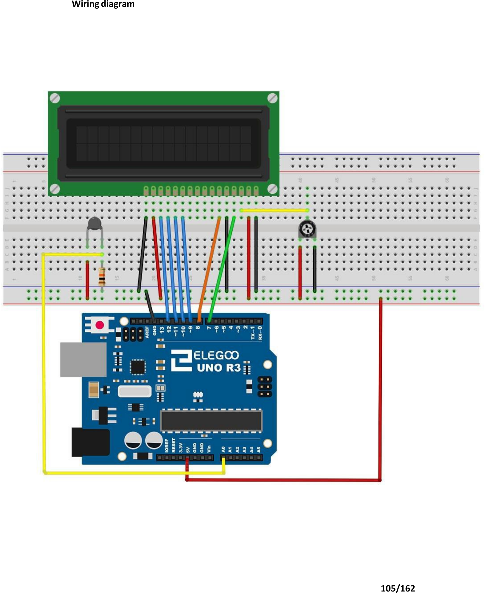

# Mission 5 · Weather Station *(Project)*

## 🎯 What you're making

You're going to build a real thermometer. Put your finger on the sensor — the temperature goes up on the screen. Pull your finger off — it drops back. Both Celsius AND Fahrenheit, updated every second. You built this.

## 🧰 Grab these parts

- [ ] Arduino Uno × 1
- [ ] Breadboard × 1
- [ ] LCD1602 display module × 1 (from the Hello Screen build)
- [ ] Potentiometer × 1 (contrast knob, from the Hello Screen build)
- [ ] Thermistor × 1 (looks like a small teardrop — darker colour, two legs)
- [ ] 10kΩ resistor × 1 (stripes: brown, black, orange)
- [ ] Jumper wires × 18 (male-to-male)

> **This is a project build.** You're combining the LCD from the Hello Screen build with a new temperature sensor. Keep the LCD wiring exactly the same as before.

## 🔌 Build it

**Keep all the LCD wires from the Hello Screen build. Just add the thermistor circuit below.**

The thermistor has two legs. Unlike an LED, it works in either direction — no right or wrong way around.

1. Push the **thermistor** into the breadboard. Its two legs go into two different rows.
2. Run a wire from **one thermistor leg** to **5V** on the Arduino.
3. Run a wire from the **other thermistor leg** to **A0** on the Arduino.
4. Place the **10kΩ resistor** with one end in that **same A0 row** (same row as step 3). Put the other end in a **GND rail**.
   - This makes a voltage divider: 5V → thermistor → A0 → 10kΩ → GND.

**The LCD wires stay exactly the same as Hello Screen:**
- LCD RS → pin 7, E → pin 8, D4 → pin 9, D5 → pin 10, D6 → pin 11, D7 → pin 12
- LCD power: VSS → GND, VDD → 5V, R/W → GND
- LCD contrast: VO → pot middle leg (pot outer legs to 5V and GND)
- LCD backlight: A → 5V, K → GND

*This is the full wiring. The thermistor is the small dark component on the left. The 10kΩ resistor connects its A0 leg to GND. The LCD and potentiometer stay the same as Hello Screen.*

## 💻 Load the code

1. Open **`sketches/m5_weather/m5_weather.ino`** in the Arduino software.
2. Set **Tools → Board → Arduino Uno**.
3. Set **Tools → Port** → `/dev/ttyUSB0` or `/dev/ttyACM0`.
4. Click **Upload**. Wait for "Done uploading."

## ✅ It works when…

The LCD shows a temperature in **°C on the top row** and **°F on the bottom row**. The numbers update every second. Hold the thermistor between your fingers — the temperature should rise by a degree or two after a few seconds.

## 🔧 Not working? Try…

- **Screen shows boxes or is blank?** Turn the contrast potentiometer slowly. This is the most common problem — same as Hello Screen.
- **Temperature reads 0 or a crazy number?** Check the thermistor row connects to both A0 (one wire) and one end of the 10kΩ resistor (other end to GND). The voltage divider must be complete.
- **Temperature is stuck and never changes?** The thermistor might be wired to the wrong analog pin. Confirm the A0 wire goes to the A0 pin on the Arduino (left side of the board, below the digital pins).
- **LCD not showing anything at all?** Check all 6 data/control wires (pins 7–12). One loose wire and the screen goes silent.
- **Upload error?** Head to Mission 0's troubleshooting section.

## 🔬 Now try this

- **Slow it down or speed it up.** Find `delay(1000)` near the bottom of the code. Change `1000` to `500` — now it updates twice a second. Change it to `5000` to update every 5 seconds.
- **Show only Fahrenheit.** Delete (or comment out with `//`) the four lines under `// Top row: Celsius`. Move the Fahrenheit print to row 0. Upload and see a single clean reading.
- **Watch it change live.** Squeeze the thermistor hard between two fingers for 30 seconds. You can feel it getting warmer — and see the temperature climb on screen. Then let go and watch it drop.

## 💡 What's happening

The thermistor is a resistor that changes its resistance when the temperature changes. When it's warm, it lets more electricity through; when it's cold, less. The 10kΩ resistor and the thermistor form a voltage divider — the Arduino reads the voltage at the middle point on A0. The code converts that number into Kelvin (using a formula called Steinhart-Hart), then into Celsius and Fahrenheit. That's the same formula the kit's own example uses.

## 👨‍👩‍👧 Grown-up's corner

The thermistor in the kit is an NTC (negative temperature coefficient) type — resistance drops as temperature rises. The Steinhart-Hart equation is the standard high-accuracy model for NTC thermistors: 1/T = A + B·ln(R) + C·(ln(R))³. The kit's coefficients (A≈0.001129148, B≈0.000234125, C≈8.76741×10⁻⁸) are a reasonable approximation; accuracy is typically ±1°C over room temperature range. The reference resistor (10kΩ) matches the thermistor's nominal resistance at 25°C, centering the voltage divider in the middle of the ADC's range for best resolution. The `math.h` log() function computes the natural log used in the equation — it's included in the AVR toolchain.
