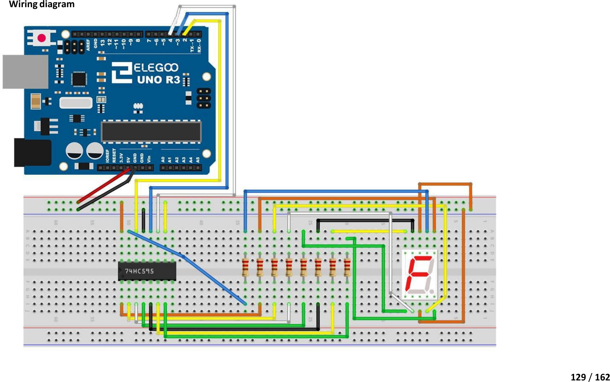

# Mission 5 · Seven-Segment Display *(Bonus)*

> **Bonus build.** This one goes deeper — you'll use a helper chip to control eight things from just three Arduino pins. Take it on when you're ready.

## 🎯 What you're making

You're going to make a single glowing digit count down from 9 to 0. The display has seven little light-up bars (segments) and a chip called a **74HC595** that controls them all. Your Arduino only needs to talk to three pins — the chip does the rest.

## 🧰 Grab these parts

- [ ] Arduino Uno × 1
- [ ] Breadboard × 1
- [ ] 74HC595 shift register IC × 1 (the small black chip with 16 legs)
- [ ] 1-digit 7-segment display × 1 (the big red digit — common cathode)
- [ ] 220Ω resistors × 8 (stripes: red, red, brown — one per segment)
- [ ] Jumper wires × 12 (male-to-male)

## 🔌 Build it

The 74HC595 chip has 16 legs — 8 on each side. Place it straddling the gap in the middle of the breadboard so the two sides don't touch.

**Step 1: Place and power the 74HC595**

1. Push the **74HC595** into the middle of the breadboard, straddling the centre gap. The notch or dot on one end points **up** — that marks pin 1.
2. The chip's **pin 16 (VCC)** is top-right → run a wire to **5V**.
3. **Pin 8 (GND)** is bottom-right → run a wire to **GND**.
4. **Pin 13 (OE)** is the 3rd from the bottom on the right → run a wire to **GND**. (Keeps outputs always on.)
5. **Pin 10 (MR)** is the 3rd from the top on the right → run a wire to **5V**. (Prevents accidental reset.)

**Step 2: Connect to Arduino**

6. **Pin 14 (DS — data)** is top-left → wire to **Arduino pin 2**.
7. **Pin 12 (ST_CP — latch)** is 3rd from the top on the left → wire to **Arduino pin 3**.
8. **Pin 11 (SH_CP — clock)** is 4th from the top on the left → wire to **Arduino pin 4**.

**Step 3: Place the 7-segment display**

9. Push the **7-segment display** into the breadboard to the right of the chip. It has 10 legs (5 on each side). The pins on the **bottom side** are labelled 1–5, top side 6–10.
10. **Pins 3 and 8** are the two common cathode legs → connect both to **GND**.

**Step 4: Connect chip outputs to display through resistors**

Each of the chip's 8 outputs (Q0–Q7) connects to one segment through a 220Ω resistor. Use the kit image to match them:

11. **74HC595 pin 15 (Q0)** → 220Ω → 7-segment **pin 7 (segment a — top bar)**
12. **74HC595 pin 1 (Q1)** → 220Ω → 7-segment **pin 6 (segment b — top right)**
13. **74HC595 pin 2 (Q2)** → 220Ω → 7-segment **pin 4 (segment c — bottom right)**
14. **74HC595 pin 3 (Q3)** → 220Ω → 7-segment **pin 2 (segment d — bottom bar)**
15. **74HC595 pin 4 (Q4)** → 220Ω → 7-segment **pin 1 (segment e — bottom left)**
16. **74HC595 pin 5 (Q5)** → 220Ω → 7-segment **pin 9 (segment f — top left)**
17. **74HC595 pin 6 (Q6)** → 220Ω → 7-segment **pin 10 (segment g — middle bar)**
18. **74HC595 pin 7 (Q7)** → 220Ω → 7-segment **pin 5 (segment dp — decimal point)**

*Match this image carefully. The 74HC595 chip is on the left. The 7-segment display is on the right. Eight resistors go between them.*

## 💻 Load the code

1. Open **`sketches/m5_seven_seg/m5_seven_seg.ino`** in the Arduino software.
2. Set **Tools → Board → Arduino Uno**.
3. Set **Tools → Port** → `/dev/ttyUSB0` or `/dev/ttyACM0`.
4. Click **Upload**. Wait for "Done uploading."

## ✅ It works when…

The 7-segment display counts down from **9 to 0**, one digit per second. After it reaches 0, the display goes blank for 2 seconds, then starts again at 9.

## 🔧 Not working? Try…

- **Display stays dark?** Check that the two common cathode pins (3 and 8 on the display) both go to GND. Also confirm VCC and GND on the 74HC595 (pins 16 and 8).
- **Some segments missing or always on?** One of the 8 resistor connections might be loose or in the wrong row. Check each Q output from the chip to its segment one by one.
- **Completely wrong digit shows?** The chip outputs might be connected in the wrong order. Compare carefully with the image — Q0 → segment a, Q1 → segment b, and so on.
- **Upload error?** Head to Mission 0's troubleshooting section for the port and permission fix.

## 🔬 Now try this

- **Change the speed.** Find `delay(1000)` in the code. Change it to `200` — now it counts down super fast.
- **Count up instead.** Find the countdown loop: `for (byte d = 10; d > 0; d--)`. Change it to `for (byte d = 0; d < 10; d++)` and change `DIGITS[d - 1]` to `DIGITS[d]`. Now it counts up.
- **Freeze on your favourite number.** In `loop()`, replace everything with just `showDigit(DIGITS[7]);` and `delay(1000);` — that shows an 8 forever. (Or pick 0–9.)

## 💡 What's happening

A 7-segment display is just seven LEDs shaped into bars. To light up any digit, you turn on the right combination of bars. But the Arduino can't drive eight things at once from one pin — that's where the **74HC595** comes in. It's a shift register: you send it 8 bits one at a time (using the data and clock pins), then pull the latch pin to snap all 8 outputs on at once. The `shiftOut()` function handles all of that automatically.

## 👨‍👩‍👧 Grown-up's corner

The 74HC595 is a serial-in, parallel-out (SIPO) shift register. `shiftOut(dataPin, clockPin, LSBFIRST, pattern)` pulses the clock 8 times, shifting one bit into the register per pulse. When latch (ST_CP) goes HIGH, all 8 bits transfer simultaneously to the output flip-flops, avoiding any visible flickering mid-update. `LSBFIRST` matches the bit order in the kit's original digit patterns (LSB = segment a). OE (output enable) is held LOW to keep outputs active at all times; MR (master reset) is held HIGH to prevent accidental clears. Each 220Ω resistor limits current to ≈ (5 V − 2 V) / 220 Ω ≈ 14 mA per segment — within the HC595's 35 mA per-output spec.
