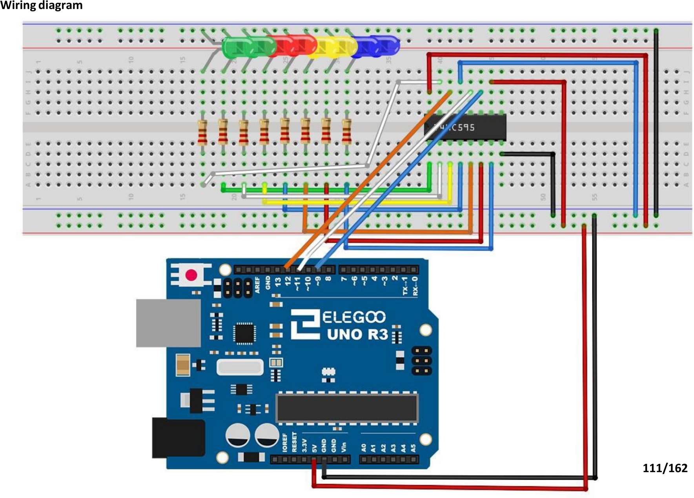

# Mission 5 · LED Bar *(Bonus)*

> **Bonus build.** Another 74HC595 shift register build — but this time you're animating eight LEDs with just three Arduino pins.

## 🎯 What you're making

Eight LEDs light up one at a time, sweeping left to right like a scanner. Then they all flash on together. Then off. Then it starts again. It looks really cool — and the Arduino is only using three pins to control all eight lights.

## 🧰 Grab these parts

- [ ] Arduino Uno × 1
- [ ] Breadboard × 1
- [ ] 74HC595 shift register IC × 1 (the small black chip with 16 legs)
- [ ] LEDs × 8 (any colour — mix them up!)
- [ ] 220Ω resistors × 8 (stripes: red, red, brown — one per LED)
- [ ] Jumper wires × 14 (male-to-male)

## 🔌 Build it

Place the 74HC595 across the centre gap of the breadboard. The notch or dot marks pin 1 — keep it pointing the same direction throughout.

**Step 1: Power the 74HC595**

1. Push the **74HC595** into the middle of the breadboard straddling the centre gap.
2. **Pin 16 (VCC)** — top-right → **5V** on the Arduino.
3. **Pin 8 (GND)** — bottom-right → **GND**.
4. **Pin 13 (OE)** — 3rd from the bottom on the right → **GND**. (Keeps outputs on.)
5. **Pin 10 (MR)** — 3rd from the top on the right → **5V**. (Prevents reset.)

**Step 2: Connect to Arduino**

6. **Pin 14 (DS — data)** — top-left → **Arduino pin 12**.
7. **Pin 12 (ST_CP — latch)** — 3rd from the top on the left → **Arduino pin 11**.
8. **Pin 11 (SH_CP — clock)** — 4th from the top on the left → **Arduino pin 9**.

**Step 3: Wire the LEDs**

Place all 8 LEDs in a row near the top of the breadboard. Long leg (+) to the left of each pair, short leg (–) to the right.

9. Connect all **8 LED short legs (–)** to the **GND rail**.
10. Place one **220Ω resistor** between each **LED long leg (+)** and the row below it.
11. Connect the free end of each resistor to a chip output:
    - Resistor 1 → **74HC595 pin 15 (Q0)**
    - Resistor 2 → **74HC595 pin 1 (Q1)**
    - Resistor 3 → **74HC595 pin 2 (Q2)**
    - Resistor 4 → **74HC595 pin 3 (Q3)**
    - Resistor 5 → **74HC595 pin 4 (Q4)**
    - Resistor 6 → **74HC595 pin 5 (Q5)**
    - Resistor 7 → **74HC595 pin 6 (Q6)**
    - Resistor 8 → **74HC595 pin 7 (Q7)**



*The 74HC595 chip is in the lower middle. Eight LEDs line up across the top. One resistor connects each chip output to one LED.*

## 💻 Load the code

1. Open **`sketches/m5_led_bar/m5_led_bar.ino`** in the Arduino software.
2. Set **Tools → Board → Arduino Uno**.
3. Set **Tools → Port** → `/dev/ttyUSB0` or `/dev/ttyACM0`.
4. Click **Upload**. Wait for "Done uploading."

## ✅ It works when…

The LEDs light up one at a time, sweeping **left to right** in 100 ms steps. Then all eight flash on together and hold for half a second. Then they all turn off for a moment. Then the sweep starts again.

## 🔧 Not working? Try…

- **No LEDs light at all?** Check pin 16 → 5V and pin 8 → GND on the chip. Also check pin 13 → GND (the output enable must be pulled LOW).
- **One LED is always off?** Its resistor connection to the chip output might be loose. Press it firmly into the breadboard hole.
- **LEDs light in the wrong order?** The connection order of Q0–Q7 to the LEDs matters. Q0 should go to the first LED on the left.
- **LEDs are on but they don't animate?** Confirm the three control wires: data → pin 12, latch → pin 11, clock → pin 9. One wrong pin and the chip never gets instructions.
- **Upload error?** Head to Mission 0's troubleshooting section.

## 🔬 Now try this

- **Change the sweep speed.** Find `delay(100)` inside the for loop. Change it to `50` for a faster sweep or `300` for a slow one.
- **Make a different pattern.** After the sweep loop, add `updateLEDs(B10101010);` to light up alternating LEDs. Then `delay(300);`. Try `B01010101` next. They alternate!
- **Count in binary.** Replace the loop with this:
  ```
  for (int i = 0; i < 256; i++) {
    updateLEDs(i);
    delay(100);
  }
  ```
  Each LED now represents a bit. You're counting from 0 to 255 — that's 8-bit binary!

## 💡 What's happening

Eight LEDs need eight signals. But the Arduino only has so many output pins — and you might want those pins for other things. The **74HC595** shift register solves this. You send it 8 bits through one wire (the data pin), timed by a clock pin. When the latch pin fires, all 8 outputs switch at once. The `1 << i` in the code moves a single ON bit from position 0 to position 7, one step at a time — that's how the sweep works.

## 👨‍👩‍👧 Grown-up's corner

`1 << i` is a bit-shift: it moves a 1-bit left by i positions in an 8-bit value, producing 0b00000001, 0b00000010, …, 0b10000000 — lighting exactly one LED at a time. The 74HC595's LSBFIRST mode means bit 0 arrives at Q0, bit 7 at Q7, matching our left-to-right order. The "count in binary" explore activity is a natural intro to binary representation: 8 LEDs = 8 bits = 0–255, and kids often visually recognise the pattern after a few seconds. Each 220Ω resistor limits current to ≈14 mA — safely below the chip's 35 mA per-output maximum and within a standard 5mm LED's rating.
