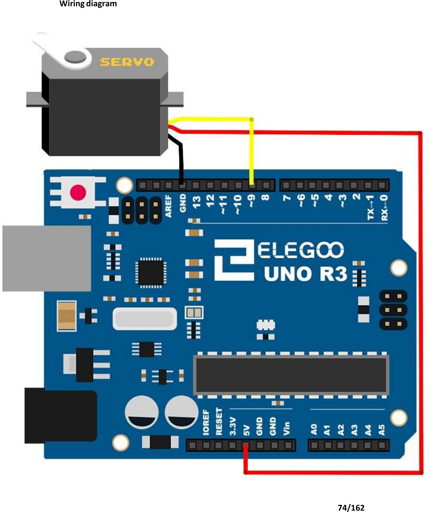

# Mission 6 · Servo Wave

## 🎯 What you're making

You're going to make a servo motor wave back and forth — all by itself. A servo is a special motor that turns to an exact angle you choose. You tell it "go to 90 degrees" and it goes there. Yours will sweep from one side to the other and back, over and over, like it's waving hello.

## 🧰 Grab these parts

- [ ] Arduino Uno × 1
- [ ] Breadboard × 1
- [ ] Servo motor (SG90) × 1
- [ ] Jumper wires × 3 (male-to-male)

## 🔌 Build it

The servo has three wires coming out of it — **brown**, **red**, and **orange**. Each one has a job.

1. Plug the **brown** servo wire into a **GND** pin on the Arduino (or GND rail on the breadboard).
2. Plug the **red** servo wire into the **5V** pin on the Arduino.
3. Plug the **orange** (signal) wire into **pin 9** on the Arduino.

That's it — no breadboard components needed. Three wires and you're wired up.

*Your servo connects directly to the Arduino with three wires: brown to GND, red to 5V, orange to pin 9.*

## 💻 Load the code

1. Open **`sketches/m6_servo/m6_servo.ino`** in the Arduino software.
2. Set **Tools → Board → Arduino Uno**.
3. Set **Tools → Port** → pick `/dev/ttyUSB0` or `/dev/ttyACM0`.
4. Click **Upload**. Wait for "Done uploading."

## ✅ It works when…

The servo arm sweeps slowly from one side all the way to the other — about a half circle — then sweeps back. It keeps going: sweep right, sweep left, sweep right, sweep left. It looks like a slow, steady wave.

## 🔧 Not working? Try…

- **Servo twitches but doesn't sweep?** Make sure the orange wire is in **pin 9** — not pin 8 or 10.
- **Nothing moves at all?** Check that the red wire is in **5V** and brown is in **GND**. Swap the brown and red if you're unsure — it won't break anything, it just won't work.
- **Upload error?** Head to Mission 0's troubleshooting section for the port and permission fix.

## 🔬 Now try this

- Find the two lines with `delay(15)`. Change both to `delay(5)`. Upload — the servo sweeps much faster now. Try `delay(30)` for a slower, more dramatic wave.
- Find `pos <= 180` and change `180` to `90`. Upload — now the servo only sweeps halfway before going back. It waves in a smaller arc.
- Find `pos += 1` and change it to `pos += 3`. Upload — the servo jumps in bigger steps. It's faster but a little jerky.

## 💡 What's happening

The `Servo` library talks to the servo using very fast pulses of electricity. A short pulse means "go left." A longer pulse means "go right." The exact pulse length tells the servo exactly what angle to hold.

The code counts up from 0 to 180 — one degree at a time — sending a new pulse for each angle. Then it counts back down. That's the sweep. The 15-millisecond delay gives the servo time to actually move before the next command arrives.

## 👨‍👩‍👧 Grown-up's corner

The SG90 servo is controlled by a 50 Hz PWM signal (20 ms period). The `Servo` library handles the timing precisely — pulse width 544 µs = 0° and 2400 µs = 180° (library defaults). The library was installed separately here because the bundled AVR core no longer includes it by default; once installed it behaves identically to the "built-in" `Servo.h` the kit documentation describes. The servo draws up to ~200 mA at stall — well within USB power budget for a free-running sweep, but avoid blocking the arm.
