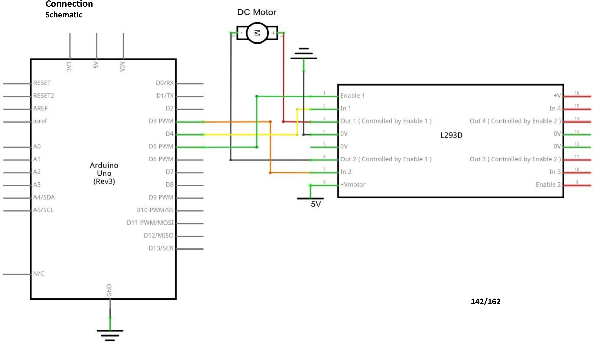

# Mission 6 · Button Fan

## 🎯 What you're making

You're going to build a fan you control with a button. Press the button once — the fan blade starts spinning. Press it again — it stops. One button, one motor, one L293D chip in the middle making it all work safely. This is the Mission 6 project build.

## 🧰 Grab these parts

- [ ] Arduino Uno × 1
- [ ] Breadboard × 1 (830 tie-points)
- [ ] L293D motor driver chip × 1
- [ ] DC motor (3–6V, the small one) × 1
- [ ] Fan blade × 1 (attaches to the motor shaft)
- [ ] Push button × 1 (small square one)
- [ ] Power Supply Module × 1
- [ ] 9V battery + adapter × 1
- [ ] Jumper wires × 10 or so (male-to-male)

## 🔌 Build it

The L293D is a 16-pin chip that goes in the middle of your breadboard. It lets the Arduino safely control the motor — connecting the motor directly to the Arduino would break it. Take your time with this one; there are several wires. **Check the kit image carefully for each wire.**

The L293D has a notch or dot on one end to show which way it goes. Pin 1 is to the left of the notch.

1. **Place the power supply module** at the end of the breadboard. Snap the 9V battery in. Flip the jumper to the **5V** position on each side. Turn it on (green LED lights up).
2. **Place the L293D chip** across the middle gap of the breadboard. Make sure the notch faces left.
3. **Connect motor power (pin 8 of L293D)** → the **5V rail** on the breadboard. This feeds the motor's power.
4. **Connect chip power (pin 16 of L293D)** → the **5V rail**. This powers the chip's logic.
5. **Connect pins 4, 5, 12, and 13 of L293D** → **GND rail**. These are the chip's ground pins. Do all four.
6. **Connect L293D pin 1 (ENABLE)** → **Arduino pin 5**.
7. **Connect L293D pin 2 (IN1)** → **Arduino pin 3**.
8. **Connect L293D pin 7 (IN2)** → **Arduino pin 4**.
9. **Connect the motor's two wires** to **L293D pins 3 and 6** (Out 1 and Out 2). One wire per pin — order doesn't matter for now; you can swap them later to reverse direction.
10. **Attach the fan blade** to the motor shaft. Press it on firmly.
11. **Place the push button** on the far left of the breadboard so each pair of legs is in different columns.
12. **Run a wire from Arduino pin 2** to one leg of the button (top side).
13. **Run a wire from GND** to the other leg of the button (bottom side).
14. **Connect Arduino GND** to the **breadboard GND rail** so everything shares a common ground.

*The kit image shows the motor and L293D. Your build adds a button on pin 2. Check the kit image for each L293D pin; the chip pin-out diagram in your kit guide shows exactly which pin is which.*

## 💻 Load the code

1. Open **`sketches/m6_button_fan/m6_button_fan.ino`** in the Arduino software.
2. Set **Tools → Board → Arduino Uno**.
3. Set **Tools → Port** → pick `/dev/ttyUSB0` or `/dev/ttyACM0`.
4. Click **Upload**. Wait for "Done uploading."

## ✅ It works when…

You press the button and the fan blade starts spinning with a steady whirr. You press the button again and it stops. Each press toggles the fan on or off. The fan stays however you left it until you press again.

## 🔧 Not working? Try…

- **Fan doesn't spin at all?** Make sure the 9V power module is ON (green LED lit) and the jumper is set to 5V. The motor needs that battery power — USB alone may not be enough.
- **Motor hums but doesn't spin?** Check that L293D pin 1 (ENABLE) is wired to pin 5 on the Arduino, not to GND or 5V directly.
- **Button does nothing?** Make sure the button legs are in different columns. Check that one leg goes to **Arduino pin 2** and the other goes to **GND**.
- **Motor spins the wrong way?** Swap the two motor wires at L293D pins 3 and 6. No code change needed.
- **Upload error?** Head to Mission 0's troubleshooting section for the port and permission fix.

## 🔬 Now try this

- In the code, find `analogWrite(ENABLE, 200)`. Change `200` to `128`. Upload and press the button — the fan spins at half speed. Try `255` for full blast.
- Find `digitalWrite(IN_A, HIGH)` and `digitalWrite(IN_B, LOW)`. Swap them: set IN_A to `LOW` and IN_B to `HIGH`. Upload — now the fan reverses direction when you turn it on.
- Change the speed by using a variable: add `int fanSpeed = 200;` at the top, and use `analogWrite(ENABLE, fanSpeed)` below. Then you can change `fanSpeed` easily in one place.

## 💡 What's happening

The L293D is a motor driver — a chip that sits between the Arduino and the motor. When you connect a motor directly to an Arduino pin, turning it off sends an electrical spike back that can damage the chip. The L293D handles the big motor current and protects the Arduino.

Inside the chip, two signal pins (IN_A and IN_B) control direction: HIGH+LOW spins one way, LOW+HIGH spins the other. The ENABLE pin controls whether the motor runs at all — and since it's a PWM pin, you can write any value from 0 to 255 to control the speed.

The button uses `INPUT_PULLUP` — the Arduino holds the pin HIGH until you press the button, which pulls it LOW. The code watches for that HIGH→LOW change and toggles the fan each time.

## 👨‍👩‍👧 Grown-up's corner

The L293D is a dual H-bridge driver, giving bidirectional control of two motors at up to 600 mA per channel. The kit's 3–6V DC motor can pull 200–400 mA under load, which exceeds the Uno's digital pin current limit of 40 mA — hence the driver chip and external 9V supply via the power module. The power module regulates 9V down to 5V for the L293D logic rail; the 9V input feeds the motor rail (pin 8) at full voltage. The `analogWrite` on pin 5 (a hardware PWM pin on Timer 0) rapidly pulses the ENABLE pin, achieving variable motor speed by duty cycle. The software debounce (`delay(50)` + edge detection) suppresses contact bounce without a dedicated debounce library.
