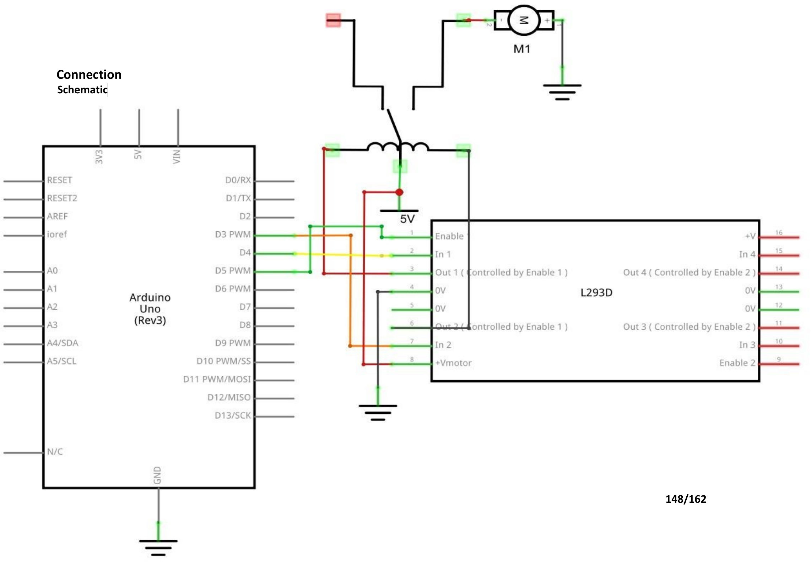

# Mission 6 · Relay Click

## 🎯 What you're making

You're going to make a relay click on and off, once a second. A relay is an electrically-controlled switch — when it clicks, you can actually **hear** it. That CLICK sound is a tiny mechanical switch snapping open and shut inside a blue plastic cube. It's incredibly satisfying. You'll build the circuit, upload the code, and then just listen.

## 🧰 Grab these parts

- [ ] Arduino Uno × 1
- [ ] Breadboard × 1 (830 tie-points)
- [ ] L293D motor driver chip × 1
- [ ] 5V relay (SRD-05VDC-SL-C) × 1
- [ ] Power Supply Module × 1
- [ ] 9V battery + adapter × 1
- [ ] Jumper wires × 8 or so (male-to-male)

## 🔌 Build it

The relay is a blue cube with 5 pins on the bottom. It needs a little current to switch — more than the Arduino can give directly. So again, the L293D chip drives the relay coil for you.

Before you insert the relay, look at it carefully. One side has three pins close together — that's the **output side** (the switch contacts). The other side has two pins — that's the **coil side** (what energizes the relay). For this build, you're only wiring the coil side; the output contacts are left empty.

1. **Place the power supply module** at the end of the breadboard. Snap the 9V battery in. Set both jumpers to **5V**. Turn it on.
2. **Place the L293D chip** across the middle gap of the breadboard with the notch facing left.
3. **Connect L293D pin 16** → **5V rail** (chip power).
4. **Connect L293D pin 8** → **5V rail** (output power for the relay coil).
5. **Connect L293D pins 4, 5, 12, and 13** → **GND rail** (all four).
6. **Connect L293D pin 1 (ENABLE)** → **Arduino pin 5**.
7. **Connect L293D pin 2 (IN1)** → **Arduino pin 3**.
8. **Connect L293D pin 7 (IN2)** → **Arduino pin 4**.
9. **Place the relay** on the breadboard. Connect its **two coil pins** to **L293D pins 3 and 6** (Out 1 and Out 2). One wire per coil pin.
10. **Connect Arduino GND** to the **breadboard GND rail**.

*The kit image shows the full layout. The relay sits to the right of the L293D. Its two coil pins connect to the L293D output pins.*

## 💻 Load the code

1. Open **`sketches/m6_relay/m6_relay.ino`** in the Arduino software.
2. Set **Tools → Board → Arduino Uno**.
3. Set **Tools → Port** → pick `/dev/ttyUSB0` or `/dev/ttyACM0`.
4. Click **Upload**. Wait for "Done uploading."

## ✅ It works when…

You hear a steady **CLICK … CLICK … CLICK** — once per second. The relay clicks on, waits a second, then clicks off, waits a second, then clicks on again. Put your hand on the relay cube and you might even feel the tiny vibration.

## 🔧 Not working? Try…

- **No clicking sound?** Make sure the power supply module is ON and the 9V battery is connected. The relay needs real power — USB alone won't be enough.
- **Clicking too fast or strange?** Check the `delay(1000)` values in the code. They should both say `1000` (1 second).
- **Nothing at all?** Verify L293D pin 1 (ENABLE) is wired to **Arduino pin 5**, and that pin 5 is running the code (upload again to be sure).
- **Upload error?** Head to Mission 0's troubleshooting section.

## 🔬 Now try this

- Find the two `delay(1000)` lines. Change both to `delay(300)`. Upload — the relay clicks much faster, like a rapid switch.
- Change the **on** delay to `2000` and the **off** delay to `200`. Upload — the relay stays on a long time and clicks off briefly. Can you hear the difference between the on-click and the off-click?
- Try `delay(500)` for both — that's click-click-click at exactly twice a second. Count them. Two clicks per second = 120 clicks per minute.

## 💡 What's happening

Inside the relay cube is a tiny electromagnet — a coil of wire. When the L293D sends current through it, the magnet pulls a metal arm down: **CLICK** — the switch closes. When the current stops, a little spring pushes the arm back up: **CLICK** — the switch opens.

That mechanical switch inside can control a completely separate circuit. The relay lets a tiny Arduino signal control something that needs much more power — without the two circuits ever touching. That's the relay's superpower: electrical isolation.

## 👨‍👩‍👧 Grown-up's corner

This kit relay (SRD-05VDC-SL-C) is a 5V coil single-pole double-throw (SPDT) relay. Its coil draws ~70–80 mA — beyond the Arduino's 40 mA pin limit, so the L293D output stage (rated 600 mA per channel) drives it safely. The relay's contact rating is 10A/250VAC and 10A/125VAC. **However, for this learning build the output contacts are left unwired.** The relay is being used only for its audible feedback — the coil energizes and the internal switch clicks, demonstrating relay operation at low voltage. Do not wire the output contacts to household mains for this project. If your child wants to see the contacts switching, use a small low-voltage LED circuit across COM and NO (normally open) at 5V — a safe, visible demo of what a relay actually switches.
