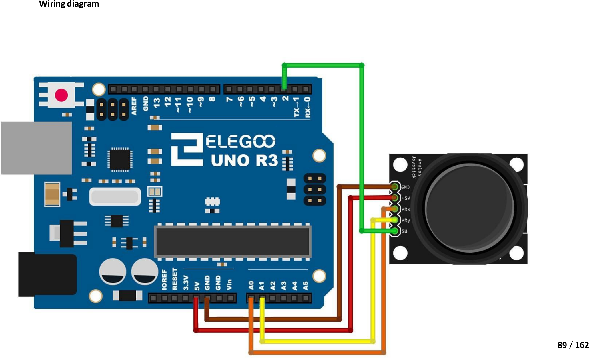

# Mission 7 · Joystick Explorer

## 🎯 What you're making

You're going to wire up a joystick just like the one in a game controller. Push it left, right, up, or down — or click it like a button. The Serial Monitor shows you the exact numbers so you can see how it works.

## 🧰 Grab these parts

- [ ] Arduino Uno × 1
- [ ] Breadboard × 1
- [ ] Joystick module × 1 (the black thumbstick on a small board — it has 5 pins)
- [ ] Jumper wires × 5 (male-to-male)

## 🔌 Build it

The joystick module has five pins. The labels are usually printed on the board: **GND**, **+5V**, **VRx**, **VRy**, and **SW**.

1. Run a wire from the **GND pin** on the joystick to a **GND pin** on the Arduino.
2. Run a wire from the **+5V pin** on the joystick to the **5V pin** on the Arduino.
3. Run a wire from the **VRx pin** (left-right) to **A0** on the Arduino.
4. Run a wire from the **VRy pin** (up-down) to **A1** on the Arduino.
5. Run a wire from the **SW pin** (the click button) to **pin 2** on the Arduino.



## 💻 Load the code

1. Open **`sketches/m7_joystick/m7_joystick.ino`** in the Arduino software.
2. Set **Tools → Board → Arduino Uno**.
3. Set **Tools → Port** → pick `/dev/ttyUSB0` or `/dev/ttyACM0`.
4. Click **Upload**. Wait for "Done uploading."
5. Go to **Tools → Serial Monitor**. Set the speed to **9600 baud** (bottom-right dropdown).

## ✅ It works when…

The Serial Monitor prints lines like this five times a second:

```
X: 512  Y: 508  Button: not pressed
```

When you push the stick left or right, the **X** number changes. Up or down changes the **Y** number. When you click the stick down, it says **PRESSED!** instead.

The middle (resting) position is around 512. Push one way and the number goes down toward 0. Push the other way and it goes up toward 1023.

## 🔧 Not working? Try…

- **All three values show 0?** Check that the **+5V pin** is connected to the **5V pin** on the Arduino (not GND). Also check GND is connected.
- **X or Y doesn't change?** Make sure the VRx and VRy wires go to **A0** and **A1** — not digital pins 0 and 1.
- **Button always shows PRESSED?** The SW wire might be missing. Check it goes to **pin 2** on the Arduino.
- **Upload error?** See Mission 0's troubleshooting for the port and permission fix.

## 🔬 Now try this

- Add an LED (long leg through 220Ω to **pin 9**, short leg to GND). Then add this code inside `loop()`, after the `delay`:
  ```cpp
  if (x < 400) {
    digitalWrite(9, HIGH);  // pushed left → LED on
  } else {
    digitalWrite(9, LOW);
  }
  ```
  Upload. Push the stick left — the LED lights up!
- Find `delay(200)` in the sketch. Change it to `delay(50)` to make it print much faster. The values update smoother when you move the stick.
- In the code, change `400` in the "Now try this" code to `600`. Now it takes a bigger push to turn the LED on.

## 💡 What's happening

Inside the joystick module are two **potentiometers** — one for left-right, one for up-down. A potentiometer is a sliding resistor. When you move the stick, it changes the resistance, which changes the voltage. The Arduino reads that voltage on A0 and A1 and turns it into a number from 0 to 1023. The click button is just a plain push-button that connects pin 2 to GND when you press the stick down.
