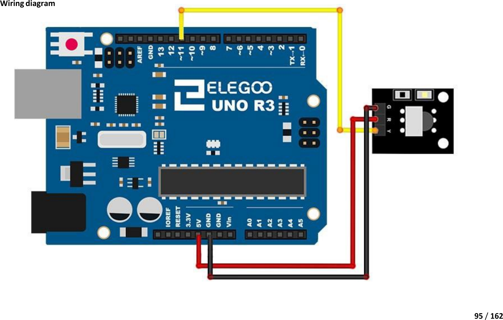

# Mission 7 · Remote-Controlled Light ★ PROJECT

## 🎯 What you're making

You're the inventor now. Press one button on your remote — the LED turns on. Press another — it turns off. Real remote control, built by you!

## 🧩 Before you start — find your button codes

You need to know the codes for two buttons on YOUR remote. Here's how:

1. Do the **IR Remote Reader build** (Build 1) first if you haven't already.
2. Open its Serial Monitor and press two buttons on the remote — any two you like.
3. Write down both codes. They look like `0xF30CFF00`.
4. You'll put those codes into this sketch in a moment.

## 🧰 Grab these parts

- [ ] Arduino Uno × 1
- [ ] Breadboard × 1
- [ ] IR receiver module × 1 (the same one from Build 1)
- [ ] LED × 1 (any color)
- [ ] 220Ω resistor × 1 (stripes: red, red, brown)
- [ ] Jumper wires × 5 (male-to-male)

## 🔌 Build it

**IR receiver** (same as Build 1):

1. Run a wire from the **GND pin** on the IR receiver to a **GND pin** on the Arduino.
2. Run a wire from the **VCC pin** on the IR receiver to the **5V pin** on the Arduino.
3. Run a wire from the **DATA pin** on the IR receiver to **pin 11** on the Arduino.

**LED**:

4. Push the LED into the breadboard. Long leg (+) and short leg (–) in two different rows.
5. Put one end of the **220Ω resistor** in the **same row as the LED's long (+) leg**. Put the other end a few rows away.
6. Run a wire from the **free end of the resistor** to **pin 6** on the Arduino.
7. Run a wire from the **LED's short (–) leg row** to a **GND pin** on the Arduino.



*Your build adds an LED to this. The LED's long leg goes through a 220Ω resistor to pin 6. Its short leg goes to GND.*

## 💻 Load the code

1. Open **`sketches/m7_remote_light/m7_remote_light.ino`** in the Arduino software.
2. Find these two lines near the top:
   ```cpp
   const uint32_t BTN_ON  = 0xF30CFF00;
   const uint32_t BTN_OFF = 0xE718FF00;
   ```
3. Replace `0xF30CFF00` with the code for your **ON button**.
4. Replace `0xE718FF00` with the code for your **OFF button**.
5. Set **Tools → Board → Arduino Uno**.
6. Set **Tools → Port** → pick `/dev/ttyUSB0` or `/dev/ttyACM0`.
7. Click **Upload**. Wait for "Done uploading."
8. Open the Serial Monitor (**Tools → Serial Monitor**) at **9600 baud** to see what's happening.

## ✅ It works when…

You point the remote at the sensor and press your ON button — the LED lights up. Press your OFF button — it goes dark. The Serial Monitor confirms with `→ LED ON` and `→ LED OFF`.

## 🔧 Not working? Try…

- **LED doesn't respond?** Open the Serial Monitor. Press a button. Look at the `Received: 0x…` line. Does the code match what you typed in? If not, copy the code from the monitor and paste it into the sketch, then upload again.
- **Both buttons do the same thing?** Check you typed two *different* codes — one for BTN_ON and one for BTN_OFF.
- **LED is in but nothing happens?** Try aiming the remote straight at the sensor's black eye from about 30 cm away. Check the remote battery.
- **LED never turns off?** Flip your two codes — you might have them swapped.
- **Upload error?** See Mission 0's troubleshooting for the port and permission fix.
- **No codes showing? Aim the remote straight at the receiver, check a fresh battery.**

## 🔬 Now try this

- Find `digitalWrite(LED_PIN, HIGH)` in the sketch. Change it to `analogWrite(LED_PIN, 128)`. Now the ON button turns the LED on at half brightness instead of full! Try different numbers (0–255).
- Add a third button code. Copy the `if (code == BTN_ON)` block and add:
  ```cpp
  else if (code == 0x????????) {   // your third button code
    digitalWrite(LED_PIN, !digitalRead(LED_PIN));  // toggle: on→off, off→on
    Serial.println("→ TOGGLE");
  }
  ```
  One button to rule them all!

## 💡 What's happening

Your remote fires an invisible infrared pattern at the sensor. The Arduino reads it and checks: is this the ON code? Is this the OFF code? Depending on the answer, it sends power to pin 6 (LED on) or stops the power (LED off). It's the same idea as every TV, stereo, and set-top box in your house. Except *you* built it.

## 👨‍👩‍👧 Grown-up's corner

The sketch hard-codes two button values from the NEC-protocol Elegoo kit remote (`0xF30CFF00` = "1", `0xE718FF00` = "2"). Because any IR remote can be used, the sheet walks the child through running the IR Reader build first to harvest their own codes. The Serial Monitor's `Received:` line is the teach-back mechanism — if the hardcoded values don't match, the child can read the correct code right off the monitor and substitute it. This avoids magic-number confusion without requiring any understanding of hex encoding. The LED is on pin 6 (PWM-capable) so the "Now try this" `analogWrite` extension works without rewiring. IRremote v4.x is required; the library install is carried from Build 1.
