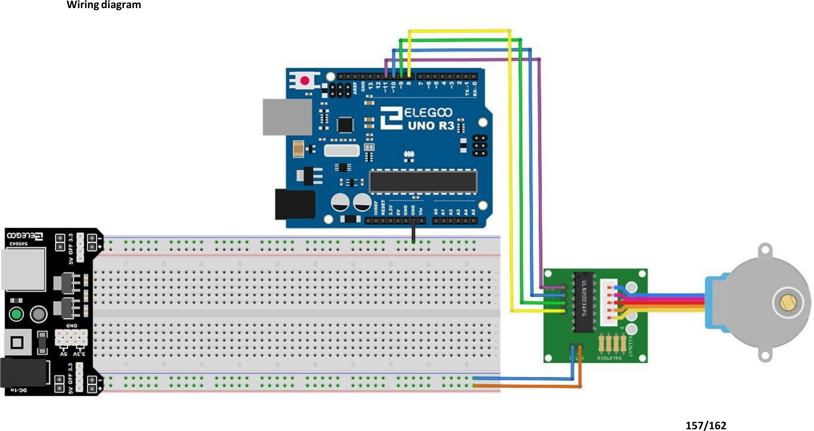

# Mission 7 · Stepper Motor ★ BONUS

## 🎯 What you're making

You're going to make a stepper motor spin. Not just spin — spin *exactly*. One full turn clockwise, pause, one full turn counter-clockwise, pause, repeat. You can feel every tiny step under your fingers. This is how robots, 3D printers, and CNC machines move precisely.

## 🧰 Grab these parts

- [ ] Arduino Uno × 1
- [ ] ULN2003 stepper driver board × 1 (the small green board with a socket for the motor plug)
- [ ] 28BYJ-48 stepper motor × 1 (the blue motor with a ribbon-cable plug)
- [ ] Jumper wires × 6 (male-to-male)

## 🔌 Build it

The ULN2003 driver board has 5 input pins on one side (IN1–IN5) and a power connector. On the other side is the socket where the motor's plug clicks in.

1. Plug the stepper motor's **white ribbon-cable connector** into the **socket on the ULN2003 board**. It only goes in one way.
2. Run a wire from the **IN1 pin** on the driver board to **pin 8** on the Arduino.
3. Run a wire from the **IN2 pin** on the driver board to **pin 10** on the Arduino.
4. Run a wire from the **IN3 pin** on the driver board to **pin 9** on the Arduino.
5. Run a wire from the **IN4 pin** on the driver board to **pin 11** on the Arduino.
6. Run a wire from the **– (GND) pin** on the driver board to a **GND pin** on the Arduino.
7. Run a wire from the **+ (VCC) pin** on the driver board to the **5V pin** on the Arduino.

The four small LEDs on the driver board will light up in a pattern when the motor is running — that's normal!



## 💻 Load the code

1. Open **`sketches/m7_stepper/m7_stepper.ino`** in the Arduino software.
2. Set **Tools → Board → Arduino Uno**.
3. Set **Tools → Port** → pick `/dev/ttyUSB0` or `/dev/ttyACM0`.
4. Click **Upload**. Wait for "Done uploading."

## ✅ It works when…

The motor turns one full revolution clockwise, pauses half a second, then one full revolution counter-clockwise, pauses, and repeats. The Serial Monitor shows:

```
Turning clockwise one full revolution...
Turning counter-clockwise one full revolution...
```

The motor moves slowly and smoothly — about 4 seconds per revolution. Hold the shaft gently between your fingers while it runs. You can feel each tiny step!

## 🔧 Not working? Try…

- **Motor not turning?** Check that IN1–IN4 on the driver board go to pins **8, 10, 9, 11** in that exact order. The order matters — mixing them up makes the motor stall.
- **Motor just vibrates but doesn't spin?** One of the four wires is wrong or loose. Re-check each IN1–IN4 wire.
- **LEDs on the driver board don't light up?** Check the power wires — VCC to 5V, GND to GND.
- **Upload error?** See Mission 0's troubleshooting for the port and permission fix.

## 🔬 Now try this

- In the sketch, find `myStepper.setSpeed(15)`. Change `15` to `5`. Upload. The motor turns much slower — you can really feel each step now. Try `17` for the fastest the motor can go.
- Change `myStepper.step(STEPS_PER_REV)` to `myStepper.step(512)`. That's a quarter revolution. Upload and watch — it only turns 90 degrees then stops and goes back!
- Add `Serial.println(STEPS_PER_REV)` inside `setup()`. Open the Serial Monitor. It will print `2048` — that's how many tiny steps it takes to go all the way around.

## 💡 What's happening

A stepper motor has four coils inside. The Arduino energises them one at a time in a careful sequence. Each time it switches coils, the motor jumps one tiny step — just 0.18 degrees. After 2048 steps, it's gone exactly 360 degrees. Because the Arduino counts every single step, it can spin to a precise position. That's the superpower of a stepper motor: **exact control**. The ULN2003 driver board boosts the Arduino's signal so it's strong enough to drive the motor's coils.

## 👨‍👩‍👧 Grown-up's corner

The 28BYJ-48 is a 5V unipolar stepper with a 1/64 gear reduction, giving 2048 steps per output shaft revolution (32 steps × 64 ≈ 2048). The kit uses the `Stepper` built-in library with constructor `Stepper(2048, 8, 10, 9, 11)` — the non-sequential pin order (8, 10, 9, 11) matches the ULN2003 coil winding order; using sequential (8, 9, 10, 11) would give vibration without rotation. Max reliable speed is ~17 rpm at 5V; above that the motor stalls. The `Stepper` library uses blocking `step()` calls, which is fine here. The ULN2003 board's indicator LEDs (one per coil) are a handy diagnostic — they should cycle in a 4-step chase pattern when running.

---

*You've reached the end of Arduino Missions. From blinking a single LED all the way to motors, sensors, displays, and remote control — you built every one of those things. That's real engineering. Go build something of your own!*
