# Your Parts — A Spotter's Guide

This is where you figure out what each part is, what it does, and how it works. Flip here whenever a mission says "grab these parts" and you want to know more.

---

## 🧠 The Brain & Power

### Arduino Uno
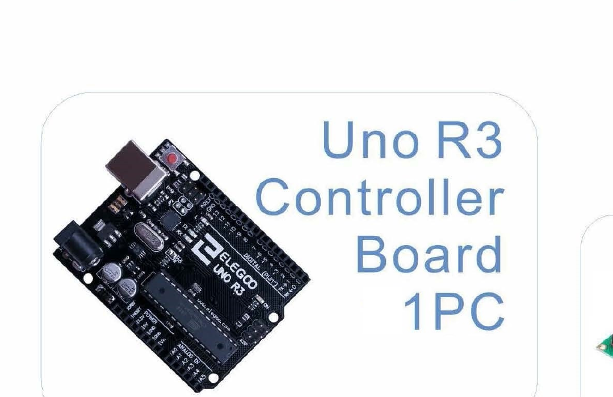
**What it does:** This is the brain — it runs your code and uses its pins to talk to everything else.
**How it works:** Your code lives on the Uno. It reads its pins, does math, and sends signals out to lights, motors, and more.
**You'll use it in:** Every mission.

### Breadboard
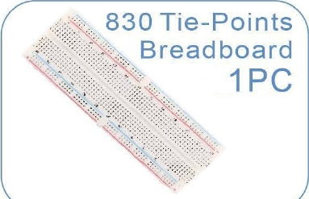
**What it does:** A board full of holes where you build circuits without any soldering.
**How it works:** The holes in each short row are secretly connected underneath. Stick two wires in the same row and they're joined.
**You'll use it in:** Every mission.

### USB Cable
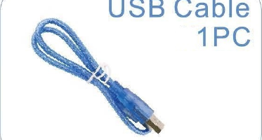
**What it does:** Carries your code from the computer into the Arduino, and powers the Arduino at the same time.
**How it works:** Plug one end into your computer, one end into the Arduino. Click Upload — your code travels down the cable.
**You'll use it in:** Every mission.

### 9V Battery
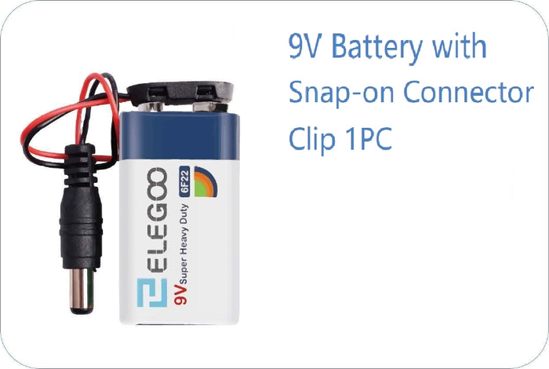
**What it does:** Powers the Arduino when there's no computer plugged in.
**How it works:** Snap a battery connector onto the top and plug it into the Arduino's barrel jack. The Arduino runs on its own.
**You'll use it in:** Extra power (Mission 6 fan); optional.

### Power Module
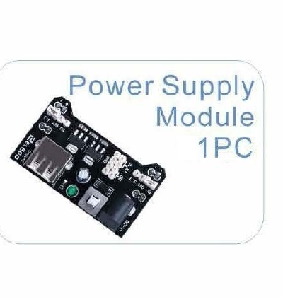
**What it does:** Puts steady 5V power along the side rails of the breadboard.
**How it works:** It snaps onto the breadboard's end and feeds both long rails with clean power so your parts have plenty to drink from.
**You'll use it in:** Optional helper.

### Proto Shield
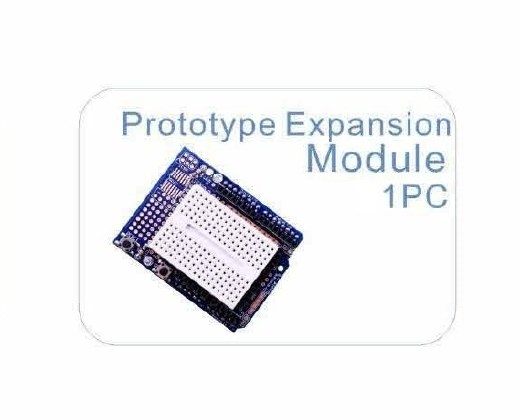
**What it does:** A board that sits right on top of the Uno so you can build a permanent project.
**How it works:** It plugs onto the Uno's pins. You solder parts onto it instead of using a breadboard — nothing falls out.
**You'll use it in:** A later project (not used in the missions).

---

## 🔗 Wires & Hidden Helpers

### Jumper Wires

**What it does:** These bendy wires carry electricity between holes on the breadboard and the Arduino's pins.
**How it works:** Push one end into a hole, the other end into wherever you want the electricity to go.
**You'll use it in:** Every mission.

### Dupont Wires

**What it does:** Wires with a socket on one end for plugging straight into modules like sensors and motors.
**How it works:** The socket end grips a module's header pins firmly so the connection stays put while things move around.
**You'll use it in:** Sensor/motor missions (4, 6, 7).

### Resistor
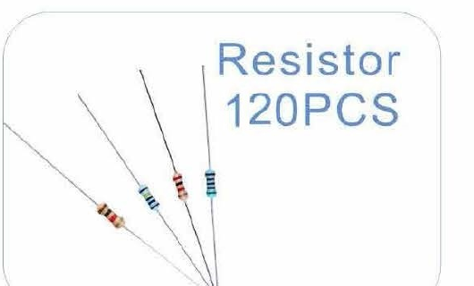
**What it does:** Slows down electricity so parts don't get too much and burn out.
**How it works:** The colored stripes on the body tell you how much it slows things down — different stripe patterns, different strengths.
**You'll use it in:** Missions 1, 2, 4, 7.

### Diode
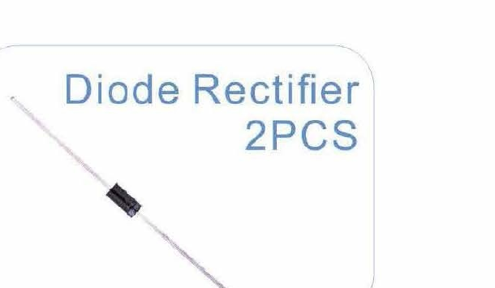
**What it does:** A one-way door for electricity — current can only flow in one direction through it.
**How it works:** The stripe on one end marks the exit side. Flip it around and electricity can't get through at all.
**You'll use it in:** A later project (not used in the missions).

### Transistor
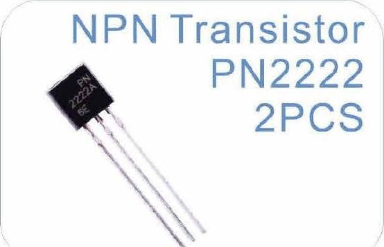
**What it does:** A tiny electric switch — a small signal on one leg switches a bigger flow on or off.
**How it works:** A little electricity on the middle leg lets a much bigger current flow between the other two legs. Small controls big.
**You'll use it in:** A later project (not used in the missions).

### 74HC595 Shift Register
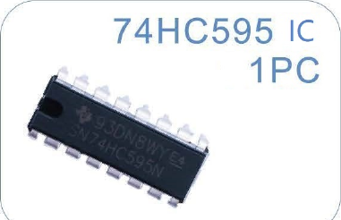
**What it does:** Lets the Arduino control 8 things at once using only 3 pins.
**How it works:** You send bits one at a time down 3 wires and the chip lines them up and holds them — like sliding tokens into 8 slots.
**You'll use it in:** Mission 5 (bonus builds).

### L293D Motor Driver
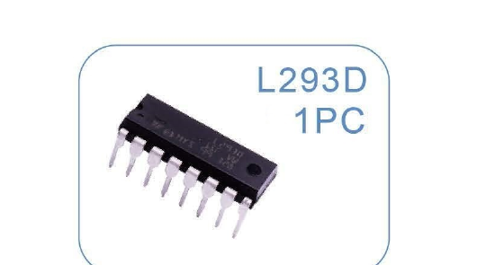
**What it does:** Lets the Arduino drive a motor's direction and speed.
**How it works:** Motors need more electrical push than an Arduino pin can give. This chip sits in the middle and does the heavy lifting.
**You'll use it in:** Mission 6.

### ULN2003 Driver Board
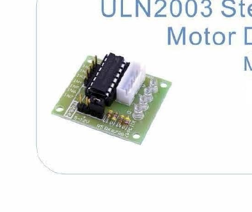
**What it does:** Powers the stepper motor's coils in exactly the right order.
**How it works:** A stepper motor has four coils that need to turn on in a careful sequence. This little board listens to the Arduino and handles that sequence for you.
**You'll use it in:** Mission 7 (bonus).

---

## 💡 Lights

### LED
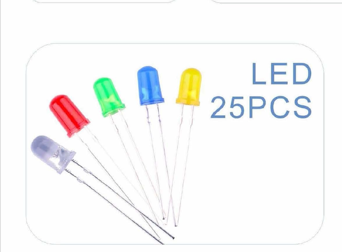
**What it does:** A tiny light that glows when electricity flows through it.
**How it works:** The long leg is + and the short leg is −. It only lights up when they're pointing the right way — and always use a resistor so it doesn't burn out.
**You'll use it in:** Missions 1, 2, 4, 7.

### RGB LED
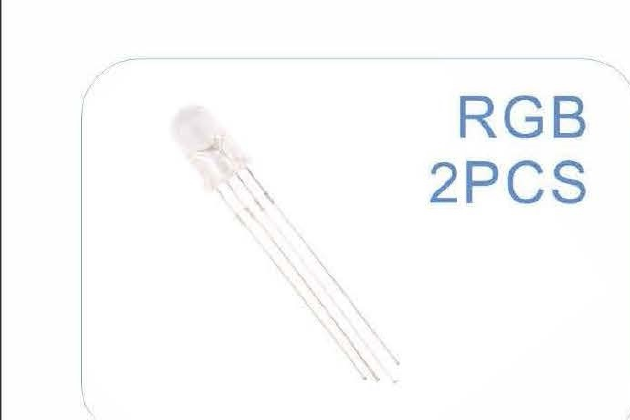
**What it does:** Three lights in one — red, green, and blue — so you can mix any color.
**How it works:** It has four legs: one shared − leg and one for each color. Turn them on at different brightnesses and the colors blend together.
**You'll use it in:** Mission 1.

---

## 🎛️ Buttons & Knobs

### Button
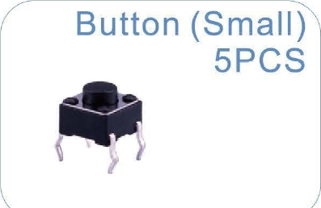
**What it does:** Connects the circuit while you hold it down, then breaks it when you let go.
**How it works:** Inside there's a little springy bridge. Press the button — bridge touches — circuit closes. Let go — spring lifts — circuit opens.
**You'll use it in:** Missions 2, 3, 6.

### Potentiometer
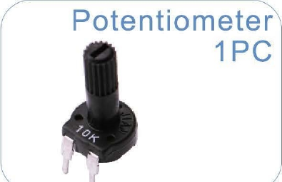
**What it does:** A knob that changes how much resistance is in the circuit as you turn it.
**How it works:** Inside is a strip of resistive material with a wiper that slides along it. The Arduino reads the middle pin as a number from 0 to 1023.
**You'll use it in:** Mission 2.

### Tilt Switch
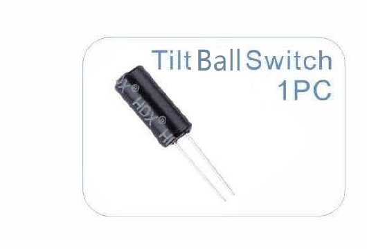
**What it does:** Detects when it gets tilted — like a tiny balance sensor.
**How it works:** There's a small metal ball inside. When you tilt it the right way, the ball rolls and touches two contacts, closing the circuit.
**You'll use it in:** Mission 4.

### Joystick
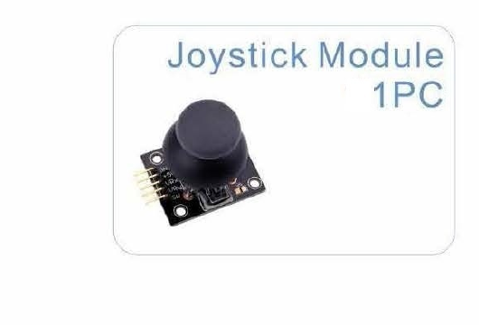
**What it does:** Two knobs in one — left/right AND up/down — plus a click when you press down.
**How it works:** It's actually two potentiometers at right angles. The Arduino reads both to know which direction you're pushing.
**You'll use it in:** Mission 7.

---

## 🔊 Sound

### Active Buzzer
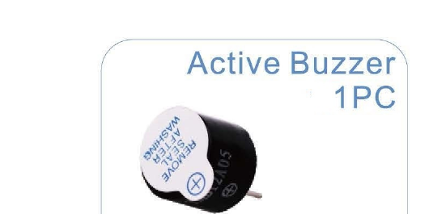
**What it does:** Makes one fixed beeping sound whenever it gets power.
**How it works:** There's an oscillator built inside — give it power and it beeps automatically. You can't change the pitch, just turn it on or off.
**You'll use it in:** Missions 3, 4.

### Passive Buzzer
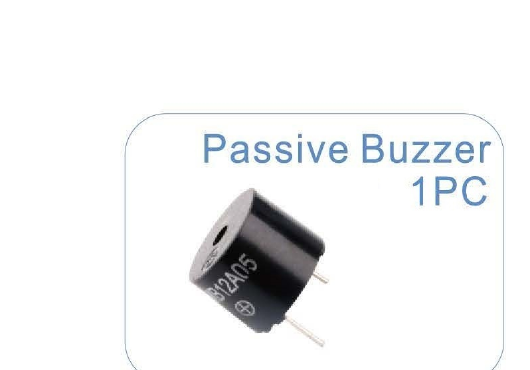
**What it does:** Plays whatever pitch you tell it — so it can make tunes and melodies.
**How it works:** No built-in oscillator. The Arduino sends a vibrating signal at the pitch you choose, and the buzzer turns that into sound.
**You'll use it in:** Mission 3.

---

## 👀 Sensors

### Photoresistor
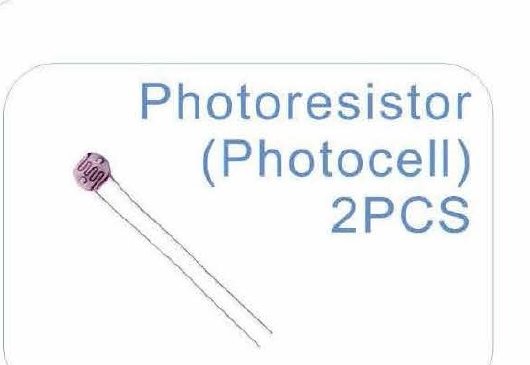
**What it does:** Tells the Arduino how bright or dark it is.
**How it works:** Its resistance drops when light hits it and rises in the dark. The Arduino reads that change as a number, so it knows bright from dark.
**You'll use it in:** Mission 4.

### Thermistor
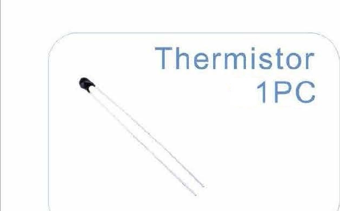
**What it does:** Tells the Arduino how hot or cold it is.
**How it works:** Its resistance changes with temperature. The Arduino reads that and does some math to turn it into a temperature number.
**You'll use it in:** Mission 5.

### Ultrasonic Sensor
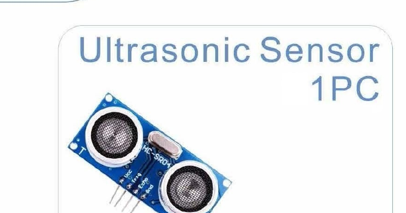
**What it does:** Measures how far away something is, like a bat.
**How it works:** It sends out a high-pitched sound chirp you can't hear, then times how long the echo takes to come back. Longer time = farther away.
**You'll use it in:** Mission 4.

### DHT11 Sensor
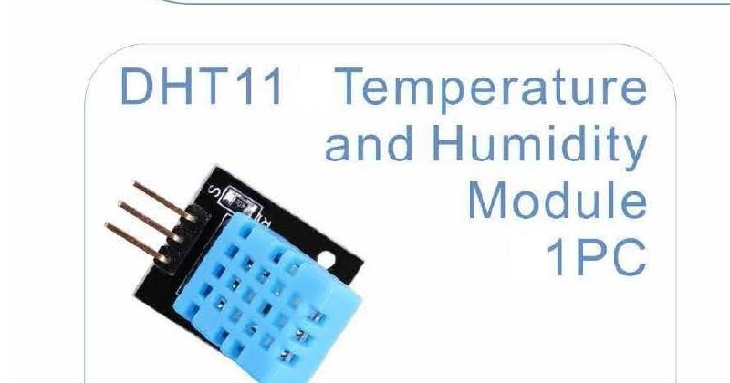
**What it does:** Measures temperature AND how damp the air is (humidity) at the same time.
**How it works:** Inside are two sensors sharing one data wire. It sends both measurements as numbers the Arduino can read.
**You'll use it in:** Mission 4 (bonus).

---

## 🔢 Screens

### LCD1602 Screen
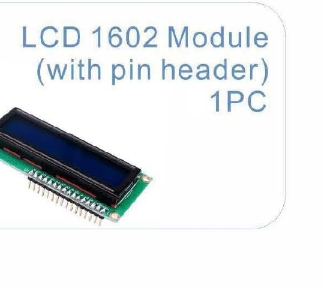
**What it does:** Shows 2 rows of 16 letters or numbers — like a tiny text screen.
**How it works:** The Arduino sends characters one at a time and the LCD puts them on screen. The little blue box on the back lets you adjust the brightness.
**You'll use it in:** Mission 5.

### 7-Segment Display (1 digit)
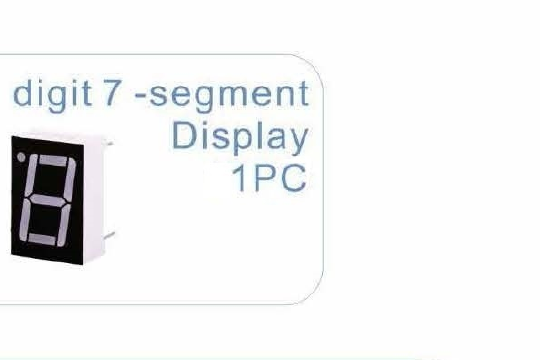
**What it does:** Shows one digit, 0 through 9, using 7 bars of light.
**How it works:** Each bar is its own LED. Light the right combination of bars and you get any digit — like drawing with light strips.
**You'll use it in:** Mission 5 (bonus).

### 7-Segment Display (4 digit)
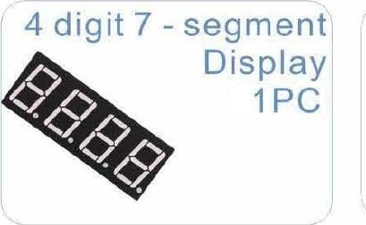
**What it does:** Four digits together — big enough for a clock or a score.
**How it works:** All four digits share the same wires but light up one at a time so fast that your eye sees all four at once.
**You'll use it in:** A harder challenge for later.

---

## ⚙️ Movers

### Servo Motor
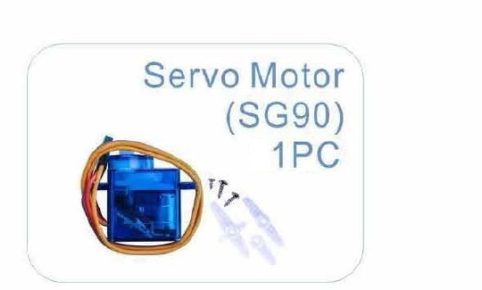
**What it does:** A motor that turns to an exact angle and holds it there.
**How it works:** Tell it a number from 0 to 180 and it swings to that exact position. Great for steering, lifting, and pointing.
**You'll use it in:** Mission 6.

### DC Motor & Fan
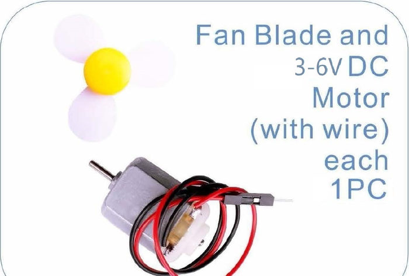
**What it does:** Spins fast when it gets power — pop the fan blade on top for a breeze.
**How it works:** Electricity flowing through it makes it spin. Flip which direction the electricity flows and the motor spins the other way.
**You'll use it in:** Mission 6.

### Stepper Motor
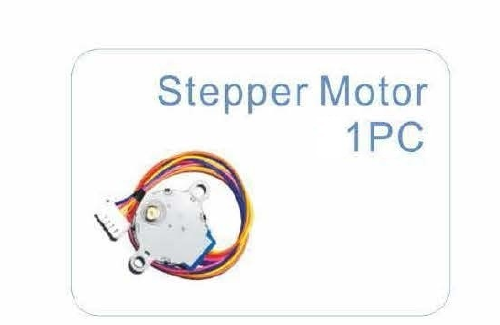
**What it does:** Moves in precise tiny steps — great when you need exact turning.
**How it works:** It has four coils inside. Turn them on in the right sequence and the motor clicks forward one tiny step at a time.
**You'll use it in:** Mission 7 (bonus).

### Relay
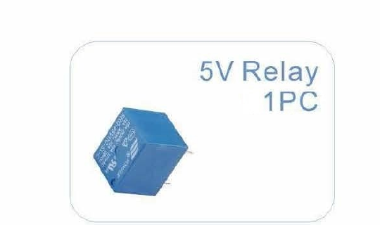
**What it does:** An electric switch you can click with a small signal to turn a bigger circuit on or off.
**How it works:** A tiny electromagnet inside pulls a metal arm down to close (or open) a bigger switch. You hear a click when it flips.
**You'll use it in:** Mission 6.

---

## 📺 Remote Control

### IR Receiver
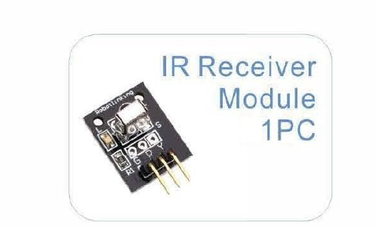
**What it does:** An "eye" that sees the invisible infrared light coming from the remote.
**How it works:** Infrared light looks like nothing to your eyes, but this little sensor spots it instantly and sends the button code to the Arduino.
**You'll use it in:** Mission 7.

### Remote Control

**What it does:** Sends your button presses as invisible infrared light — just like a TV remote.
**How it works:** Press a button and it flashes a coded pattern of infrared light. The IR receiver catches it and the Arduino figures out which button you pressed.
**You'll use it in:** Mission 7.
